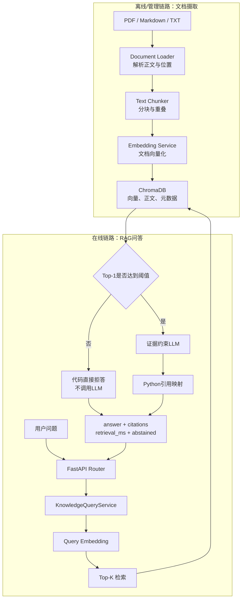

# Robot Knowledge Base API

一个面向机器人研发场景的工程文档 RAG 服务。

项目支持摄取公开或脱敏的 PDF、Markdown 和 TXT 文档，将文档切分、向量化并持久化到 ChromaDB；用户可以通过自然语言查询知识库，获得只基于检索证据生成的回答和可定位到原始文件、页码或章节的引用。

项目同时保留 Week 1 实现的机器人故障分诊 API，用于展示普通 LLM 应用、SSE 流式输出与 RAG 问答之间的架构差异。

> 本项目是 AI 应用工程学习项目，不是生产级机器人控制或安全认证系统。所有诊断、维修和安全操作仍需由具备资质的人员依据设备原厂资料确认。

## 1. 核心能力

### 知识库文档管理

- 上传 PDF、Markdown、TXT 文档。
- 校验文件类型、大小和空文本。
- 使用文件 SHA-256 生成稳定的 `document_id`。
- 拒绝重复文档。
- 保存文档、Chunk 和 Embedding 元数据。
- 列出已摄取文档及 Chunk 数量。
- 按 `document_id` 删除文档产生的全部向量。

### RAG 问答

- 将问题转换为 Query Embedding。
- 从 ChromaDB 检索 Top-K Chunk。
- 返回文件名、页码或章节、Chunk ID、排名、相似度和原文片段。
- Top-1 相似度低于阈值时直接拒答，不调用生成式 LLM。
- Prompt 要求模型只根据当前证据回答。
- 引用由 Python 根据真实检索结果组装，不接受模型自造来源。
- 保留文档状态限定词和与问题直接相关的安全约束。

### 评测与实验

- 20 条机器可读取的 Gold Question。
- 包含单跳、多跳和知识库无答案问题。
- 检索评测：Recall@1、Recall@3、无答案错误召回率。
- 引用评测：引用正确率、覆盖率、完整证据回答率和正确拒答率。
- RAG 与裸 LLM 可复现实验。
- 使用 Fake Embedding、Fake LLM 和 Mock HTTP 完成无网络测试。

## 2. RAG 在整体 AI 应用架构中的位置



RAG 不负责训练模型，也不会把全部文档直接放进 Prompt。它把知识访问拆成两个阶段：

```text
检索：先从知识库找到最相关的少量证据
生成：再让LLM仅依据这些证据组织回答
```

这样设计的主要原因是：

- LLM 的训练知识可能过时或不包含组织内部规则。
- 全量文档通常超过模型上下文窗口。
- 直接依赖模型记忆无法提供可验证来源。
- 工业安全和故障处理不能允许模型随意补全参数。
- 无证据时应由业务代码拒答，而不是要求模型猜测。

## 3. 技术栈

| 依赖 | 主要职责 |
|---|---|
| `fastapi` | HTTP API、Router、依赖注入、OpenAPI |
| `uvicorn[standard]` | 运行 ASGI 应用 |
| `pydantic` / `pydantic-settings` | 数据契约、校验、环境配置 |
| `openai` | 调用 OpenAI 兼容的 LLM 和 Embedding API |
| `chromadb` | 本地向量持久化与相似度检索 |
| `pdfplumber` | 提取文本型 PDF 的逐页正文 |
| `python-multipart` | 解析 FastAPI 文件上传请求 |
| `httpx` | 异步 HTTP 客户端和 API 测试 |
| `sse-starlette` | Week 1 故障分诊 SSE 流式响应 |
| `pytest` | 自动化测试框架 |
| `pytest-asyncio` | 执行异步测试 |

## 4. 环境要求

- 推荐并已验证：Python 3.11.15
- 导师独立验收环境：Python 3.12，当前源码收集并通过 244 个测试
- Conda 或其他 Python 虚拟环境
- Windows PowerShell、Bash 或其他终端
- OpenAI 兼容的生成式 LLM API
- OpenAI 兼容的 Embedding API

LLM 和 Embedding 可以使用不同的服务商、密钥和 Base URL。

## 5. 创建环境并安装依赖

以下所有命令都必须在项目根目录执行。项目根目录应同时包含：

```text
main.py
app/
scripts/
tests/
requirements.txt
```

克隆仓库后先进入该目录：

```powershell
git clone <repository-url>
Set-Location <repository-directory>
```

确认当前目录正确：

```powershell
Test-Path -LiteralPath "main.py"
Test-Path -LiteralPath "app"
Test-Path -LiteralPath "tests"
```

三条命令都应返回 `True`。从仓库上层目录直接运行测试会导致 Python 找不到 `app` 和 `scripts`。

创建 Python 3.11 环境：

```powershell
conda create -n analysys python=3.11
```

激活环境：

```powershell
conda activate analysys
```

确认版本：

```powershell
python --version
```

安装全部依赖：

```powershell
python -m pip install -r requirements.txt
```

检查依赖关系：

```powershell
python -m pip check
```

## 6. 配置环境变量

复制模板：

```powershell
Copy-Item .env.example .env
```

填写 `.env`：

```dotenv
# 生成式LLM
LLM_API_KEY=your-llm-api-key
LLM_BASE_URL=https://your-llm-provider.example/v1
LLM_MODEL=your-llm-model-name

# Embedding服务
EMBEDDING_API_KEY=your-embedding-api-key
EMBEDDING_BASE_URL=https://your-embedding-provider.example/v1
EMBEDDING_MODEL=your-embedding-model-name

# ChromaDB
CHROMA_PERSIST_DIRECTORY=chroma_data
CHROMA_COLLECTION_NAME=robot_knowledge

# 切分与批处理
RAG_CHUNK_SIZE=800
RAG_CHUNK_OVERLAP=120
EMBEDDING_BATCH_SIZE=64

# Top-1低于该值时直接拒答
RAG_SIMILARITY_THRESHOLD=0.60

# 单文件上限：20 MiB
MAX_DOCUMENT_SIZE_BYTES=20971520
```

重要说明：

- `.env` 可能包含真实 API Key，不得提交。
- LLM 和 Embedding 配置彼此独立。
- 修改 `.env` 后应重启 FastAPI。
- 同一个 Chroma Collection 中应使用相同的 Embedding 模型和向量维度。
- 更换 Embedding 模型后应使用新的 Collection 名称并重新摄取。
- `0.60` 是当前语料、模型和评测集上的校准结果，不是通用阈值。

## 7. 准备语料

将公开或经过授权、脱敏的文档放入：

```text
data/source/
```

支持：

```text
.pdf
.md
.txt
```

当前实验使用了五份语料：

1. Cognex DataMan 260 Series 公开参考手册。
2. Victron Energy Lithium Smart Battery 公开手册。
3. 工业移动机器人安全标准征求意见稿。
4. 自编、脱敏的仓储机器人故障说明。
5. 根据公开仓储场景编写的机器人测试规程与判定标准。

第 5 项是用于学习和评测的自编文档，不代表京东官方内部标准或实际作业规程。

公开仓库不会包含上述原始资料。厂商手册和标准草案可能保留版权，只能由使用者根据官方来源自行下载；两份自编资料也不从本地 `data/source/` 直接发布。仓库仅提供一个可公开分发的最小模拟语料，用于验证摄取链路：

```text
samples/corpus/robot-fault-demo.txt
```

将最小样例复制到本地语料目录：

```powershell
Copy-Item `
  "samples/corpus/robot-fault-demo.txt" `
  "data/source/robot-fault-demo.txt"
```

该样例只用于冒烟验证，不能复现五份完整语料上的 V4 评测指标。

详细来源、许可证和脱敏说明见：

- [语料来源说明](docs/corpus-sources.md)

只允许使用：

- 公开资料；
- 获得授权的资料；
- 完成脱敏的自编资料。

不得上传：

- 客户未公开数据；
- 个人信息；
- 未获授权的内部手册；
- 真实密钥、账号或访问令牌；
- 仍能识别具体客户或设备的数据。

## 8. 摄取文档

### 通过命令行脚本摄取目录

在一个新的空 Collection 中执行：

```powershell
python -m scripts.ingest_documents `
  --source-dir data/source `
  --output docs/ingestion-log.md
```

这里的“命令行脚本”表示不经过文档上传 HTTP API，并不表示可以断网运行。脚本不会调用生成式 LLM，但会调用真实 Embedding 服务，因此需要有效的 Embedding 配置、网络连接，并可能产生 API 费用。

内部流程：

```text
扫描文件
→ 校验类型和大小
→ 计算SHA-256
→ 解析正文和页码/章节
→ 切分Chunk
→ 批量Embedding
→ 写入ChromaDB
→ 生成摄取日志
```

如果当前 Collection 已包含相同文件，系统会根据文件哈希拒绝重复摄取。需要重新摄取时，应删除原文档或使用新的 Collection。

### 通过 HTTP API 上传

启动服务后可在 Swagger UI 使用：

```text
POST /api/v1/knowledge/documents
```

也可以使用：

```powershell
curl.exe -i `
  -X POST `
  "http://127.0.0.1:8000/api/v1/knowledge/documents" `
  -F "file=@data/source/your-document.txt"
```

成功状态：

```text
201 Created
```

响应示例：

```json
{
  "document_id": "64位SHA-256",
  "source_file": "your-document.txt",
  "file_type": "txt",
  "file_size_bytes": 1024,
  "page_or_section_count": 1,
  "chunk_count": 2,
  "embedding_model": "your-embedding-model",
  "status": "ready"
}
```

上传 API 是同步摄取接口：只有解析、切分、Embedding 和 Chroma 写入全部成功后才返回 `201 Created`。

## 9. 启动 API

```powershell
python -m uvicorn main:app `
  --host 127.0.0.1 `
  --port 8000
```

本地开发时可以增加：

```text
--reload
```

服务地址：

```text
http://127.0.0.1:8000
```

健康检查：

```powershell
curl.exe -i `
  "http://127.0.0.1:8000/health"
```

Swagger UI：

- [http://127.0.0.1:8000/docs](http://127.0.0.1:8000/docs)

OpenAPI JSON：

- [http://127.0.0.1:8000/openapi.json](http://127.0.0.1:8000/openapi.json)

所有响应都由 Middleware 添加：

```text
X-Request-ID
```

该 ID 可用于关联客户端错误响应和服务端日志。

## 10. API 接口

| 方法 | 路径 | 职责 |
|---|---|---|
| `GET` | `/health` | 检查 API 进程 |
| `POST` | `/api/v1/knowledge/documents` | 上传并摄取文档 |
| `GET` | `/api/v1/knowledge/documents` | 列出已摄取文档 |
| `DELETE` | `/api/v1/knowledge/documents/{document_id}` | 删除文档及其 Chunk |
| `POST` | `/api/v1/knowledge/query` | 检索并根据证据回答 |
| `POST` | `/api/v1/triage` | Week 1 普通故障分诊 |
| `POST` | `/api/v1/triage/stream` | Week 1 SSE 流式故障分诊 |

### 列出文档

```powershell
curl.exe -sS `
  "http://127.0.0.1:8000/api/v1/knowledge/documents"
```

响应：

```json
{
  "documents": [
    {
      "document_id": "64位SHA-256",
      "source_file": "document.pdf",
      "file_type": "pdf",
      "file_size_bytes": 1024,
      "page_or_section_count": 10,
      "chunk_count": 20,
      "embedding_model": "embedding-model",
      "status": "ready"
    }
  ]
}
```

### 删除文档

```powershell
curl.exe -i `
  -X DELETE `
  "http://127.0.0.1:8000/api/v1/knowledge/documents/DOCUMENT_ID"
```

成功响应：

```json
{
  "document_id": "DOCUMENT_ID",
  "deleted": true
}
```

### 查询知识库

推荐通过 Swagger UI 测试，也可以使用项目已经安装的 `httpx`：

```powershell
python -c "import json, httpx; response = httpx.post('http://127.0.0.1:8000/api/v1/knowledge/query', json={'question': '工业移动机器人安全标准征求意见稿适用于哪些生命周期阶段、行业和机器人类型？', 'top_k': 3}, timeout=120.0); print(response.status_code); print(json.dumps(response.json(), ensure_ascii=False, indent=2))"
```

成功回答示例：

```json
{
  "answer": "只根据检索证据生成的回答",
  "citations": [
    {
      "chunk_id": "document-id:000015",
      "document_id": "64位SHA-256",
      "source_file": "工业移动机器人安全标准.pdf",
      "page_or_section": "page: 5",
      "chunk_index": 15,
      "rank": 1,
      "similarity": 0.66,
      "excerpt": "支持回答的原始证据片段"
    }
  ],
  "retrieval_ms": 200.0,
  "abstained": false
}
```

证据不足时：

```json
{
  "answer": "知识库没有足够证据回答该问题。",
  "citations": [],
  "retrieval_ms": 150.0,
  "abstained": true
}
```

拒答路径不会调用生成式 LLM。

## 11. 数据与版本控制规则

以下内容已通过 `.gitignore` 排除：

```text
.env
data/source/*
data/processed/
chroma_data/
__pycache__/
.pytest_cache/
要求.txt
week*验收.txt
week1.txt
week2.txt
week3.txt
docs中的原始JSON和含长原文评测报告
```

目录职责：

| 路径 | 职责 | 是否提交 |
|---|---|---|
| `data/source/` | 原始 PDF、MD、TXT | 否，只保留 `.gitkeep` |
| `data/processed/` | 解析和切分中间结果 | 否 |
| `data/eval/gold_questions.jsonl` | 20 条评测问题 | 是 |
| `chroma_data/` | ChromaDB 向量和元数据 | 否 |
| `docs/` | 脱敏后的报告、架构和测试说明 | 只提交不含长原文的公开版本 |
| `.env` | 密钥和真实配置 | 否 |
| `.env.example` | 无密钥配置模板 | 是 |

原始评测报告可能包含完整 Chunk、`content` 或 `excerpt`，因此只保存在本地。公开仓库只提交不含原文的汇总报告。

## 12. 检索评测

运行真实 Embedding 和 ChromaDB 检索：

```powershell
python -m scripts.evaluate_retrieval `
  --questions data/eval/gold_questions.jsonl `
  --json-output docs/retrieval-evaluation.json `
  --markdown-output docs/retrieval-evaluation.md `
  --top-k 3 `
  --similarity-threshold 0.60
```

该命令会访问真实 Embedding 服务，但不会调用生成式 LLM。

当前 `robot_knowledge_v4` 记录结果：

| 指标 | 结果 |
|---|---:|
| 可回答问题数 | 16 |
| 无答案问题数 | 4 |
| 证据级 Recall@1 | 0.600 |
| 证据级 Recall@3 | 0.850 |
| 无答案错误召回率 | 0.000 |

目标 `Recall@3 >= 0.80` 已达到。

公开报告：

- [检索评测脱敏摘要](docs/retrieval-evaluation-summary.md)

完整 JSON 和带正文预览的本地报告由脚本生成，但受 `.gitignore` 排除。

## 13. 引用评测

FastAPI 运行时执行：

```powershell
python -m scripts.evaluate_citations `
  --questions data/eval/gold_questions.jsonl `
  --api-url "http://127.0.0.1:8000/api/v1/knowledge/query" `
  --json-output docs/citation-evaluation-threshold-060-v2.json `
  --markdown-output docs/citation-evaluation-threshold-060-v2.md `
  --top-k 3 `
  --timeout-seconds 120
```

该命令会调用真实 Embedding、ChromaDB 和生成式 LLM，可能产生 API 费用。

当前阈值 `0.60` 的记录结果：

| 指标 | 结果 |
|---|---:|
| 可回答问题数 | 16 |
| 无答案问题数 | 4 |
| 实际回答的可回答问题数 | 7 |
| 引用正确率 | 1.000 |
| 引用覆盖率 | 0.400 |
| 可回答问题响应率 | 0.438 |
| 完整证据回答率 | 0.438 |
| 无答案问题正确拒答率 | 1.000 |

覆盖率较低是当前保守阈值的结果：系统优先避免错误回答，只放行检索证据经过校准的 7 道可回答问题。

公开报告：

- [引用评测脱敏摘要](docs/citation-evaluation-summary.md)

完整 JSON 和带回答明细的本地报告由脚本生成，但受 `.gitignore` 排除。

## 14. RAG 与裸 LLM 对照实验

FastAPI 运行时执行：

```powershell
python -m scripts.compare_rag_vs_bare_llm `
  --question-id q014 `
  --question-id q020 `
  --top-k 3 `
  --timeout-seconds 120 `
  --json-output docs/rag-vs-bare-llm.json `
  --markdown-output docs/rag-vs-bare-llm.md
```

该实验使用同一个生成模型：

- RAG 组通过正式知识库 API 获得检索证据。
- 裸 LLM 组只获得问题和谨慎回答规则。
- 裸 LLM 不会看到 Gold 答案、预期证据或 RAG 响应。

实验观察：

- q014 中，RAG 找到两项项目专有证据并给出可追溯引用。
- 裸 LLM 给出了无当前语料支持的通用温度和恢复条件，并提出与测试规程冲突的堵转建议。
- q020 中，RAG 通过相似度门控直接拒答，不调用生成式 LLM。
- 裸 LLM 也谨慎拒答，但仍产生了一次模型调用。
- 初次实验发现 RAG 遗漏了“不得真实堵转”的安全禁令。
- 增强安全约束 Prompt 后，q014 V2 明确保留了该禁令。

公开报告：

- [RAG 与裸 LLM 脱敏摘要](docs/rag-vs-bare-llm-summary.md)

完整实验回答和原始引用只保存在本地，不进入公开仓库。

单次实验受模型随机性和网络延迟影响，只用于案例分析，不替代完整评测。

## 15. 自动化测试

运行全部测试并禁用 pytest 缓存：

```powershell
python -m pytest `
  tests/ `
  -q `
  -p no:cacheprovider `
  --junitxml=docs/pytest-results-week2.xml
```

当前源码的预期结果为 `244 passed`。JUnit XML 是真实测试执行产生的机器可读证据，不能使用 `.pytest_cache` 中可能过期的节点列表代替。

核心测试使用：

- Fake Embedding；
- Fake LLM；
- `httpx.MockTransport`；
- FastAPI 依赖覆盖；
- pytest `monkeypatch`；
- 临时目录 `tmp_path`。

自动化测试不应：

- 访问真实 LLM；
- 访问真实 Embedding；
- 使用真实 API Key；
- 修改正式 Chroma Collection；
- 依赖外部网络。

主要覆盖：

- PDF、Markdown、TXT 解析；
- Chunk 边界、重叠和元数据；
- Embedding 批处理与缓存；
- 余弦相似度检索；
- ChromaDB 写入、检索和删除；
- 重复摄取和上传大小限制；
- Gold Question 数据契约；
- 检索与引用评测计算；
- Top-K 排名和来源；
- 低相似度拒答；
- 引用白名单映射；
- LLM 无效响应与超时；
- 知识库 API；
- RAG 与裸 LLM 实验和报告生成。

## 16. 项目结构

```text
week-02code/
├── app/
│   ├── middleware/
│   │   └── request_id.py
│   ├── routers/
│   │   ├── health.py
│   │   ├── knowledge.py
│   │   └── triage.py
│   ├── schemas/
│   │   ├── citation_evaluation.py
│   │   ├── evaluation.py
│   │   ├── knowledge.py
│   │   ├── knowledge_query.py
│   │   ├── rag_comparison.py
│   │   ├── retrieval.py
│   │   └── triage.py
│   ├── services/
│   │   ├── bare_llm.py
│   │   ├── chunking.py
│   │   ├── citation_evaluation.py
│   │   ├── document_catalog.py
│   │   ├── document_loader.py
│   │   ├── document_service.py
│   │   ├── embedding.py
│   │   ├── knowledge_answer.py
│   │   ├── knowledge_query.py
│   │   ├── retrieval.py
│   │   └── vector_store.py
│   ├── config.py
│   ├── dependencies.py
│   ├── errors.py
│   └── exception_handlers.py
├── data/
│   ├── eval/
│   │   └── gold_questions.jsonl
│   ├── processed/
│   └── source/
│       └── .gitkeep
├── samples/
│   └── corpus/
│       └── robot-fault-demo.txt
├── docs/
│   ├── corpus-sources.md
│   ├── retrieval-evaluation-summary.md
│   ├── citation-evaluation-summary.md
│   ├── rag-vs-bare-llm-summary.md
│   ├── architecture.md
│   ├── pytest-results-week2.xml
│   ├── test-report_week2.md
│   ├── 工程复盘_week2.md
│   └── 工程总结_week2.md
├── scripts/
│   ├── compare_chunking.py
│   ├── compare_rag_vs_bare_llm.py
│   ├── evaluate_citations.py
│   ├── evaluate_retrieval.py
│   ├── ingest_documents.py
│   └── run_retrieval_baseline.py
├── tests/
├── .env.example
├── .gitignore
├── main.py
├── README.md
└── requirements.txt
```

## 17. 已知限制

- `pdfplumber` 适用于含文本层的 PDF，不提供完整 OCR。
- 扫描版 PDF、复杂表格、多栏排版和图片文字可能解析不完整。
- PDF 英文空格恢复使用启发式规则，不能保证所有版式完全正确。
- 当前 ChromaDB 是本地单机持久化方案，不适合直接作为多用户生产数据库。
- 当前 API 没有用户认证、权限控制、速率限制和租户隔离。
- 文档上传采用同步摄取，大文件需要等待 Embedding 完成。
- 相似度阈值只对当前语料、Embedding 模型和 Gold 集有效。
- 当前检索仍有 q007、q008、q009 等失败案例，需要通过语料、查询改写、混合检索或 Reranker 继续改进。
- RAG 只适合当前静态知识库，不能回答实时位置、电量和订单。
- 实时机器人状态应通过 RCS、WMS、遥测服务或工具调用获取。
- Prompt 是软约束，模型输出仍需经过 Schema、代码规则和人工审核。
- 安全关键操作不能只依赖 LLM 回答执行。
- 当前没有正式前端、Agent、多用户系统或生产部署配置。
- SSE 只用于 Week 1 故障分诊，知识库查询当前使用普通 JSON 响应。

## 18. 进一步阅读

- [语料来源说明](docs/corpus-sources.md)
- [系统架构](docs/architecture.md)
- [检索评测脱敏摘要](docs/retrieval-evaluation-summary.md)
- [引用评测脱敏摘要](docs/citation-evaluation-summary.md)
- [RAG 与裸 LLM 脱敏摘要](docs/rag-vs-bare-llm-summary.md)
- [自动化测试报告](docs/test-report_week2.md)
- [学习复盘](docs/工程复盘_week2.md)
- [完整工程总结](docs/工程总结_week2.md)
