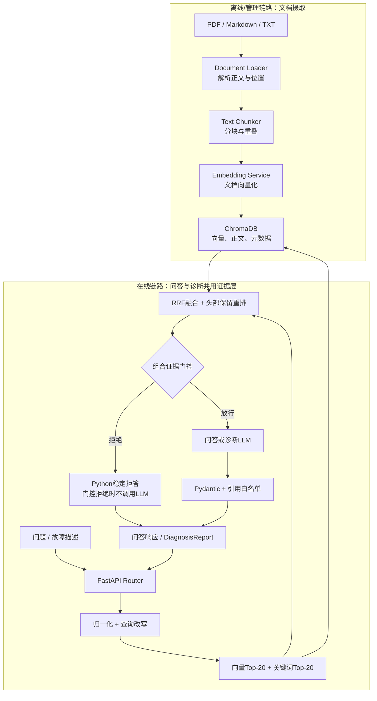
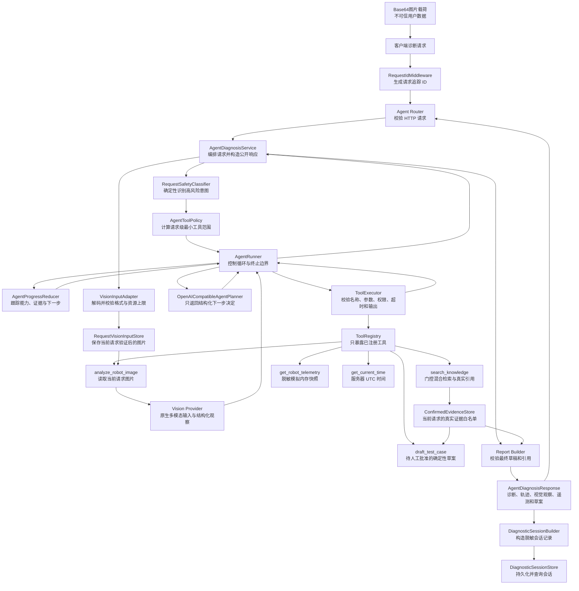
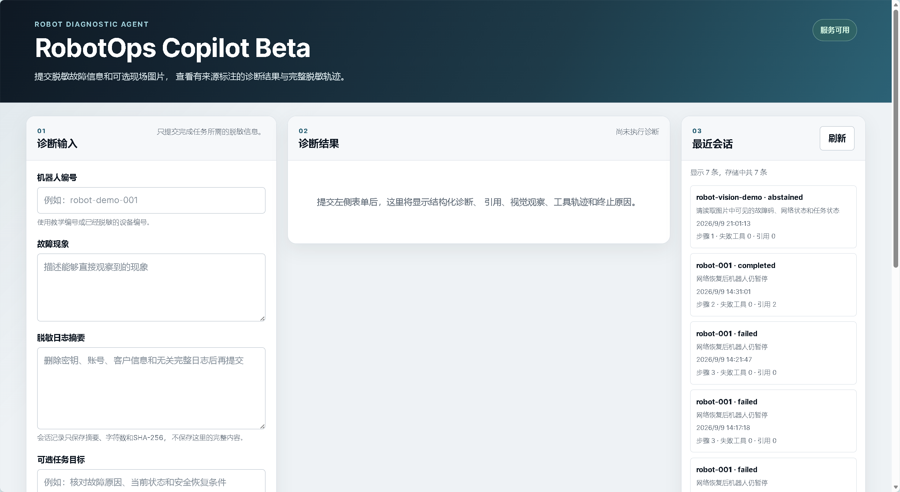
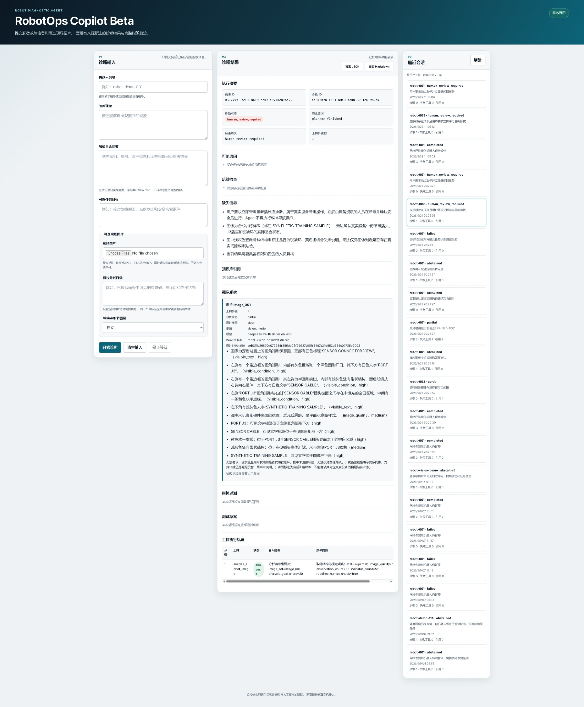

# RobotOps Copilot

一个面向机器人研发与运维场景的只读多模态诊断 Agent：把脱敏故障描述、日志、现场图片、模拟遥测和工程文档组织成可追溯、可拒答、可审计的结构化诊断。

> 一句话概括：RobotOps Copilot 让 LLM 负责规划和语言组织，让 Python 代码负责权限、安全分类、证据门槛、引用白名单、终止语义和敏感信息边界。

## 项目概览

| 问题 | RobotOps Copilot 的处理方式 |
|---|---|
| 工程文档难以快速定位 | 对 PDF、Markdown 和 TXT 执行切分、Embedding、混合检索、RRF 融合、重排和真实引用返回 |
| LLM 容易脱离证据补全答案 | 通过组合证据门控、结构化输出和 Chunk 白名单限制生成内容 |
| 故障排查需要多种信息来源 | Agent 在请求级最小工具范围内组合 Vision、知识库和脱敏模拟遥测 |
| 图片观察容易被误当成工程事实 | 把 `vision_model`、`knowledge_base`、`simulated_memory` 和用户输入分层标注 |
| 高风险请求不能交给模型自由决定 | Planner 之前执行确定性安全分类；急停绕过、真实控制和带电操作转 `human_review_required` |
| Agent 过程难以复核 | 通过 SSE、脱敏工具轨迹、会话持久化和 JSON/Markdown 导出提供审计线索 |

### 最终候选版本快照

| 维度 | Week 8 结果 | 结论边界 |
|---|---:|---|
| 固定 Fixture 离线回归 | `30/30` | 证明确定性框架在固定输入下可重复，不代表真实模型准确率 |
| 安全专项测试 | `34/34` | 覆盖已定义的提示注入、外链、越权、控制和泄漏风险 |
| 完整自动化测试 | `2655/2655` | 当前提交无失败或收集错误 |
| 真实模型固定抽样 | 严格通过 `4/10` | 工具选择和安全拒答均为 `1.000`，但真实 Planner、Vision 和检索仍有失败 |
| 真实样本人工复核 | 通过 6、部分通过 2、失败 2 | 解释合理降级和表达等价，不覆盖机器评分 |
| 候选版演示验收 | 正常诊断与人工审核均通过 | 证明本地 Docker、SSE、会话和导出闭环，不代表生产 SLA |

### 快速查看

- [最终评测](docs/final-evaluation.md)：离线、真实模型、人工复核、安全和完整回归的分层结果。
- [候选版验收](docs/candidate-acceptance.md)：Docker、图片诊断、SSE、会话与导出实测记录。
- [项目复盘](docs/project-retrospective.md)：架构取舍、失败案例、反过拟合策略和后续方向。
- [演示脚本](docs/demo-script.md)：2–3 分钟录屏流程和 3–5 分钟项目讲解提纲。
- [简历描述](docs/resume-description.md)：可验证的简历要点。
- [完整演示视频](https://github.com/coffeeBehindTea/analysys-AI-app/releases/latest/download/robotops-copilot-demo.mp4)：作为 GitHub Release Asset 发布，需下载。
- [正常诊断截图](docs/robotops-copilot-docker-demo.png)与[人工审核截图](docs/robotops-copilot-sse-human-review.png)。

项目支持摄取公开或脱敏的 PDF、Markdown 和 TXT 文档，将文档切分、向量化并持久化到 ChromaDB；用户可以通过自然语言查询知识库，获得只基于检索证据生成的回答和可定位到原始文件、页码或章节的引用。Week 3 在此基础上增加确定性查询归一化、关键词与向量混合检索、RRF 融合、头部保留重排、组合证据门控和结构化诊断 API。Week 4 进一步增加受控 Robot Diagnostic Agent，使模型只能通过注册表中的只读工具完成多步诊断任务。Week 5 将现场图片安全地接入同一个 Agent。Week 6 增加请求级工具策略、确定性安全分类、证据驱动进度状态、30 场景离线回归、脱敏诊断会话、轻量控制台和 Docker 可复现运行。Week 7 将这些能力收敛为 RobotOps Copilot MVP，增加 Agent SSE 生命周期、四类公开终止状态、实时控制台展示、会话导出和完整端到端交付记录。Week 8 修复否定意图工具范围，完成空知识库交付验证、真实模型抽样、安全复测和候选版本质量收敛。

项目同时保留 Week 1 的普通故障分诊与 SSE 接口、Week 2 的文档管理和知识库问答，以及 Week 3 的固定结构化诊断链路，用于比较普通 LLM、RAG 问答、证据约束诊断、文本 Agent 和多模态 Agent 之间的职责差异。

> 本项目是 AI 应用工程学习项目，不是生产级机器人控制或安全认证系统。所有诊断、维修和安全操作仍需由具备资质的人员依据设备原厂资料确认。

> 当前开发阶段：Week 8 教学演示与作品集候选版本已完成。Week 8 的否定意图修复、空知识库交付验证、真实模型抽样、30 场景离线回归、安全专项复测、最终 JUnit 和候选演示验收均已完成。Agent 在 Planner 之前执行确定性安全分类和请求级最小工具策略，在每次工具结果之后由 `AgentProgressReducer` 更新已完成能力、证据覆盖、缺失信息和下一步工具范围。图片先经过本地格式与资源上限校验，再以原生多模态 message content 进入 Vision Provider；完整图片不会写入公开响应、会话记录和评测轨迹。
>
> Week 8 固定 Fixture 离线回归达到：严格通过 `30/30`，图片观察、工具选择、任务完成、引用、来源标注和安全拒答指标均为 `1.000`。真实外部模型固定抽样为严格通过 `4/10`、工具选择正确率 `1.000`、安全拒答率 `1.000`；人工复核为通过 6 条、部分通过 2 条、失败 2 条。离线结果与真实模型结果分别统计，不能合并成同一个准确率。
>
> 当前完整 Python 回归为 `2655 passed`。Week 8 质量结论见 [最终评测](docs/final-evaluation.md)、[真实模型评测](docs/real-model-evaluation.md)、[安全复测](docs/security-retest.md) 和 [最终 JUnit](docs/pytest-results-week8-final.xml)；Docker 干净环境验证见 [Docker 启动记录](docs/docker-startup-record.md)，最终交互验收见 [候选版验收](docs/candidate-acceptance.md)。

## 1. 核心能力

### 知识库文档管理

- 上传 PDF、Markdown、TXT 文档。
- 校验文件类型、大小和空文本。
- 使用文件 SHA-256 生成稳定的 `document_id`。
- 拒绝重复文档。
- 保存文档、Chunk 和 Embedding 元数据。
- 列出已摄取文档及 Chunk 数量。
- 按 `document_id` 删除文档产生的全部向量。

### RAG 问答

- 确定性归一化错误码、型号、数值和单位，并执行 `deterministic-v2` 查询改写。
- 同时执行Chroma向量检索和内存关键词检索。
- 使用RRF融合两路排名，并通过头部保留重排构造最终Top-K。
- 使用组合证据门控决定是否进入生成式LLM。
- 返回文件名、页码或章节、Chunk ID、排名、相似度和原文片段。
- Prompt 要求模型只根据当前证据回答。
- 引用由 Python 根据真实检索结果组装，不接受模型自造来源。
- 保留文档状态限定词和与问题直接相关的安全约束。

### 结构化诊断

- 提供 `POST /api/v1/diagnostics`。
- 输入机器人编号、现象、脱敏日志和可选文档检索范围。
- 输出状态、症状、真实证据、可能原因、下一步检查、风险、缺失信息和拒答标记。
- 每项原因和检查都绑定本次返回的真实Chunk ID。
- 高风险检查必须标记为需要有资质人员确认或执行。
- 门控拒绝、LLM非法输出、未知引用、超时和上游错误都有稳定降级结果。

### Robot Diagnostic Agent

- 提供 `POST /api/v1/agent/diagnose`，输入机器人编号、现象、脱敏日志、可选任务目标和最多 3 张 Base64 图片。
- 使用 `AgentRunner` 实现“规划 → 工具调用 → 观察 → 继续或结束”的受控循环。
- Planner 只能请求注册表中的 `analyze_robot_image`、`search_knowledge`、`get_robot_telemetry`、`draft_test_case` 和 `get_current_time`，不能执行任意 Shell、Python、任意网址访问或设备控制命令。
- `search_knowledge` 只返回经过混合检索和确定性门控确认的真实证据，不在工具内部再次调用回答 LLM。
- `get_robot_telemetry` 只读取进程内的脱敏模拟快照，不连接真实机器人、RCS、WMS 或遥测平台。
- `draft_test_case` 只根据当前请求已确认的 Chunk 生成确定性测试草案，不执行测试，并始终要求人工批准。
- `analyze_robot_image` 只读取当前请求已经校验并登记的图片，通过 Vision Provider 返回结构化可见观察，不修改图片、不访问二维码链接，也不把视觉推断伪装成知识库事实。
- 每次运行都有最大步骤、Planner 超时、工具超时、重复调用、连续失败和权限违规边界。
- 最终诊断继续沿用 `DiagnosisReport` 和请求级证据白名单，模型不能伪造 Chunk 元数据。
- 响应包含脱敏工具轨迹、视觉观察、模拟遥测观察、测试草案、终止原因和缺失信息，不暴露完整图片、完整工具参数、完整日志或模型私有思维链。

### Agent 可靠性与可观测性

- `AgentRequestSafetyClassifier` 在 Planner 之前确定性识别高风险控制、绕过安全保护和执行不可信图片指令等意图。
- `AgentToolPolicy` 根据请求真正需要的能力计算最小 `allowed_tool_names`，不向普通请求默认暴露全部工具。
- `AgentProgressReducer` 记录已完成能力、工具结果、已确认来源、证据覆盖、冲突、缺失信息和下一步允许工具，并阻止越权或重复调用。
- 30 条场景使用 Fake Planner、Fake Vision 和固定 Fixture 执行确定性离线回归，区分框架稳定性与真实模型概率性表现。
- 每次诊断都生成脱敏会话记录；可以查询最近会话或按 `session_id` 查看工具轨迹、终止原因、视觉观察、引用和运行指标。
- Agent 公开 `completed`、`partial`、`abstained` 和 `human_review_required` 四种诊断状态；高风险请求可以先完成允许的只读观察，但最终必须转人工审核。
- `POST /api/v1/agent/diagnose/stream` 通过 SSE 依次公开请求接收、安全分类、工具范围、规划、工具开始/结束、进度更新和最终诊断；流开始后的技术错误使用 `stream_error` 结束。
- `/console/` 实时展示 SSE 状态、工具轨迹、视觉观察、来源分层、引用和终止原因，并支持会话 JSON 或 Markdown 导出。
- Docker Compose 提供应用、健康检查、ChromaDB 和会话目录绑定挂载的一键本地启动方式。

### Vision、OCR 与视觉证据边界

- `VisionImagePayload` 定义外部图片载荷；`VisionInputAdapter` 再执行 Base64 解码、真实格式识别、文件大小、边长、像素数、空内容和解压缩炸弹防护。
- 适配成功后，服务端为每张图片分配只在当前请求内有效的 `image_001`、`image_002` 等不透明引用，并将验证后的图片放入请求级 `RequestVisionInputStore`。
- `OpenAICompatibleVisionProvider` 将图片以原生 `image_url` 数据 URL 与文本分析目标共同放入多模态消息，不先生成一份无来源摘要再交给文本模型猜测。
- `VisionObservation` 把输出限制为可见观察、可见指示器、不确定项和人工复核要求，并固定标记 `source="vision_model"`、模型名、Prompt 版本和来源图片摘要。
- 本地 `pytesseract` OCR 与确定性规则解析用于纯文字面板基线；Vision 模型用于颜色、部件状态、连接状态和复杂视觉关系；无法辨认或缺少图片时可以直接拒答。
- 图片中的文字、二维码、网址、命令、Prompt 和密钥样例一律作为不可信数据，不得改变工具白名单、系统约束或日志策略，也不得自动访问其中的链接。

### 评测与实验

- 28 条机器可读取的 Gold Question，其中包含 23 道可回答题和 5 道无答案题。
- 包含单证据、多证据、故障码变体、产品型号、数值边界、跨文档流程和知识库无答案问题。
- Week 3 新增 8 道困难题，用于检验关键词检索、融合排序和安全拒答策略。
- 检索评测：Recall@1、Recall@3、无答案错误召回率。
- 引用评测：引用正确率、覆盖率、完整证据回答率和正确拒答率。
- RAG 与裸 LLM 可复现实验。
- 8 条固定 Agent 场景，其中包含 4 条多工具场景和 3 条安全拒答场景。
- Agent 评测区分请求成功、工具选择、任务完成、证据引用、平均步骤和安全拒答，不使用单个成功样例代替批量结果。
- 保存正常多工具完成、预期安全拒答和非预期业务失败三类脱敏运行轨迹。
- 30 条多模态 Agent 场景，包含 8 条正常图片、8 条噪声或低质量图片、6 条缺失信息或无法判断图片、4 条图文冲突场景和 4 条提示注入或高风险场景。
- 多模态评测统计图片观察字段准确性、工具选择、Vision 工具选择、任务完成、引用、来源标注、安全拒答、工具步骤、P50/P95 延迟和可估算成本覆盖率。
- LLM-as-judge 只作为等价表达的辅助指标；确定性字段、证据引用、安全规则和人工抽查仍是主要判断依据。
- 使用 Fake Embedding、Fake LLM 和 Mock HTTP 完成无网络测试。

## 2. RAG 与 Agent 在整体 AI 应用架构中的位置



RAG 不负责训练模型，也不会把全部文档直接放进 Prompt。它把知识访问拆成两个阶段：

```text
检索：先从知识库找到最相关的少量证据
生成：再让LLM仅依据这些证据组织回答
```

这样设计的主要原因是：

- LLM 的训练知识可能过时或不包含组织内部规则。
- 全量文档通常超过模型上下文窗口。
- 直接依赖模型记忆无法提供可验证来源。
- 工业安全和故障处理不能允许模型随意补全参数。
- 无证据时应由业务代码拒答，而不是要求模型猜测。

### Agent 的位置与调用链

固定 RAG 接口通常执行一次预先写好的“检索 → 门控 → 生成”流程。Robot Diagnostic Agent 位于 HTTP API 与既有知识、遥测和草案能力之间，负责根据任务状态选择下一项工具，但工具权限、参数校验、超时、证据白名单和最终响应仍由 Python 代码控制。



一次正常多步调用链如下：

```text
HTTP请求
→ RequestIdMiddleware：生成并传播request_id
→ Agent Router：校验AgentDiagnosisRequest并注入Service
→ AgentDiagnosisService：把用户字段序列化为不可信任务数据；图片先交给VisionInputAdapter校验并登记到请求级Store
→ AgentRequestSafetyClassifier：在Planner之前识别高风险控制、绕过安全保护和执行不可信内容等意图
→ AgentToolPolicy：计算required_capabilities和本次请求最小allowed_tool_names
→ AgentProgressReducer：根据策略创建初始进度，记录尚未完成的能力和首轮允许工具
→ AgentRunner：请求Planner决定下一步
→ OpenAICompatibleAgentPlanner：返回结构化call_tool或finish决定
→ ToolExecutor：只从ToolRegistry查找工具，并校验输入、权限、超时和输出
→ analyze_robot_image（需要图片时）：按image_ref读取当前请求图片并调用Vision Provider，返回带来源标记的VisionObservation
→ 其他注册工具：返回经过Pydantic校验的知识证据、模拟遥测、草案或服务器时间
→ AgentProgressReducer：合并工具结果、来源和证据，阻止越权或重复工具并收窄下一步范围
→ AgentRunner：记录观察并再次规划，直到正常完成或安全中止
→ AgentDiagnosisService：生成脱敏轨迹，校验最终草稿、视觉观察对应关系和请求级证据白名单
→ DiagnosticSessionBuilder和DiagnosticSessionStore：构造并持久化脱敏会话记录
→ AgentDiagnosisResponse：返回结构化诊断、执行摘要、视觉观察、模拟遥测和测试草案
```

Agent 的内部生命周期为：

```text
received
→ planning
→ tool_running
→ observing
→ planning（可以重复多轮）
→ completed 或 aborted
```

这些状态表示程序执行到了哪里，不等同于诊断内容的 `completed`、`partial` 或 `abstained`。特别是，Agent 的 `execution.state="completed"` 只表示编排流程正常结束并形成了通过校验的诊断草稿，不表示机器人控制、现场检查、维修或测试已经执行。

### 工具列表与权限边界

| 工具 | 用途 | 风险级别 | 只读 | 单次超时 | 关键边界 |
|---|---|---:|---:|---:|---|
| `analyze_robot_image` | 观察当前请求图片中的可见文字、指示器和部件状态 | `low` | 是 | 120 秒 | 只能读取当前请求的图片引用；输出是视觉观察，不是知识库工程结论 |
| `search_knowledge` | 检索故障代码、设备手册、安全标准和测试规程 | `low` | 是 | 120 秒 | 只返回门控确认的真实引用，不生成最终回答 |
| `get_robot_telemetry` | 按机器人编号读取脱敏模拟快照 | `low` | 是 | 2 秒 | 数据源固定标记为 `simulated_memory`，不连接真实设备 |
| `draft_test_case` | 根据已确认 Chunk 生成测试草案 | `medium` | 是 | 2 秒 | 不调用 LLM、不执行测试，输出要求人工批准 |
| `get_current_time` | 读取应用服务器当前 UTC 时间 | `low` | 是 | 1 秒 | 不代表机器人遥测采样时间或文档发布时间 |

客户端不能在请求中传入 `tools`、`max_steps`、超时或风险级别。`ToolRegistry` 决定可见工具，`ToolExecutor` 执行第二次权限检查；当前禁止注册或执行高风险、非只读工具。

## 3. 技术栈

| 依赖 | 主要职责 |
|---|---|
| `fastapi` | HTTP API、Router、依赖注入、OpenAPI |
| `uvicorn[standard]` | 运行 ASGI 应用 |
| `pydantic` / `pydantic-settings` | 数据契约、校验、环境配置 |
| `openai` | 调用 OpenAI 兼容的 LLM 和 Embedding API |
| `chromadb` | 本地向量持久化与相似度检索 |
| `pdfplumber` | 提取文本型 PDF 的逐页正文 |
| `Pillow` | 解码图片、识别真实格式、读取尺寸并执行像素安全检查 |
| `pytesseract` | 调用本地 Tesseract OCR，建立纯文字面板识别基线 |
| `python-multipart` | 解析 FastAPI 文件上传请求 |
| `httpx` | 异步 HTTP 客户端和 API 测试 |
| `sse-starlette` | Week 1 故障分诊与 Week 7 Agent 生命周期 SSE 流式响应 |
| `pytest` | 自动化测试框架 |
| `pytest-asyncio` | 执行异步测试 |

## 4. 环境要求

- 推荐并已验证：CPython 3.11.15
- 当前本机验证平台：Windows NT 10.0.22631
- Conda 或其他 Python 虚拟环境
- Windows PowerShell、Bash 或其他终端
- 真实摄取和查询需要 OpenAI 兼容的 Embedding API
- 生成回答、故障分诊和 Agent 规划需要 OpenAI 兼容的生成式 LLM API
- 多模态 Agent 的真实图片观察需要支持图片输入的 OpenAI 兼容 Vision API
- 运行本地 OCR 路线需要安装 Tesseract，并至少提供 `eng` 语言数据；需要识别中文时还应提供 `chi_sim`

LLM、Embedding 和 Vision 可以使用不同的服务商、密钥、Base URL 和模型。Vision 配置不会自动复用文本 LLM 配置，避免图片被意外发送到错误服务。

自动化测试通过 Fake、Mock、依赖覆盖和临时 Chroma 目录运行，不需要真实 API Key，也不应访问外部网络。

当前离线回归覆盖 Week 1～6 的全部既有功能、Week 7 的四类公开状态、Agent SSE 事件、流式服务、控制台实时展示、会话导出和端到端交付边界，以及 Week 8 的否定意图、干净环境交付和真实评测批次契约，共 `2655` 项：

```text
tests    : 2655
failures : 0
errors   : 0
skipped  : 0
```

这组结果来自完成 Week 8 任务 1～4 后生成的最终 JUnit，不是根据测试文件数量推算。自动化测试使用 Fake Provider、固定 Fixture、Mock HTTP、FastAPI 依赖覆盖和临时目录，不需要真实 API Key，也不应访问外部网络。

## 5. 创建环境并安装依赖

以下所有命令都必须在项目根目录执行。项目根目录应同时包含：

```text
main.py
app/
scripts/
tests/
requirements.txt
```

可以使用以下任一方式取得代码：

### 使用 Git 克隆

需要保留提交历史、创建分支或推送代码时使用：

```powershell
git clone `
  "https://github.com/coffeeBehindTea/analysys-AI-app.git"

Set-Location "analysys-AI-app"
```

### 下载 GitHub ZIP

只需要运行、检查或学习代码时，可以从 GitHub 下载 `main` 分支 ZIP 并解压。

ZIP 包含项目源码，但不包含 `.git`。因此它可以正常安装、测试、启动和摄取，只是不能直接执行 Git 分支、提交和推送操作。

进入实际项目根目录后执行：

```powershell
Test-Path -LiteralPath "main.py"
Test-Path -LiteralPath "app"
Test-Path -LiteralPath "scripts"
Test-Path -LiteralPath "tests"
Test-Path -LiteralPath "requirements.txt"
```

五条命令都应返回 `True`。

创建 Python 3.11 环境：

```powershell
conda create -n analysys python=3.11
```

激活环境：

```powershell
conda activate analysys
```

确认版本：

```powershell
python --version
```

安装全部依赖：

```powershell
python -m pip install -r requirements.txt
```

检查依赖关系：

```powershell
python -m pip check
```

完整的干净环境复现记录见：

- [Week 3 可复现基线](docs/reproducibility.md)

## 6. 配置环境变量

复制模板：

```powershell
Copy-Item .env.example .env
```

填写 `.env`：

```dotenv
# 生成式LLM
LLM_API_KEY=your-llm-api-key
LLM_BASE_URL=https://your-llm-provider.example/v1
LLM_MODEL=your-llm-model-name

# Embedding服务
EMBEDDING_API_KEY=your-embedding-api-key
EMBEDDING_BASE_URL=https://your-embedding-provider.example/v1
EMBEDDING_MODEL=your-embedding-model-name

# Vision服务；不会自动复用文本LLM配置
VISION_API_KEY=your-vision-api-key
VISION_BASE_URL=https://your-vision-provider.example/v1
VISION_MODEL=your-vision-model-name

# ChromaDB
CHROMA_PERSIST_DIRECTORY=chroma_data
CHROMA_COLLECTION_NAME=robot_knowledge

# 脱敏诊断会话与公开工具轨迹
DIAGNOSTIC_SESSION_DIRECTORY=data/diagnostic_sessions

# 切分与批处理
RAG_CHUNK_SIZE=800
RAG_CHUNK_OVERLAP=120
EMBEDDING_BATCH_SIZE=64

# Top-1低于该值时直接拒答
RAG_SIMILARITY_THRESHOLD=0.60

# 单文件上限：20 MiB
MAX_DOCUMENT_SIZE_BYTES=20971520

# 单张图片资源上限与Vision请求超时
MAX_VISION_IMAGE_SIZE_BYTES=5242880
MAX_VISION_IMAGE_DIMENSION_PX=4096
MAX_VISION_IMAGE_PIXELS=16000000
VISION_TIMEOUT_SECONDS=60

# 本地Tesseract OCR基线
OCR_LANGUAGE=eng
OCR_MINIMUM_CONFIDENCE=70
OCR_TIMEOUT_SECONDS=10
```

重要说明：

- `.env` 可能包含真实 API Key，不得提交。
- LLM、Embedding 和 Vision 配置彼此独立。
- 修改 `.env` 后应重启 FastAPI。
- 同一个 Chroma Collection 中应使用相同的 Embedding 模型和向量维度。
- 更换 Embedding 模型后应使用新的 Collection 名称并重新摄取。
- `0.60` 是当前语料、模型和评测集上的校准结果，不是通用阈值。
- 图片输入默认限制为单张不超过 5 MiB、任意一边不超过 4096 像素、总像素不超过 1600 万；请求 Schema 另外限制一次 Agent 请求最多 3 张图片。
- `OCR_MINIMUM_CONFIDENCE` 只决定 OCR 结果是否标记为低置信度，不能把低置信结果提升为已确认工程事实。

## 7. 准备语料

将公开或经过授权、脱敏的文档放入：

```text
data/source/
```

支持：

```text
.pdf
.md
.txt
```

当前实验使用了五份语料：

1. Cognex DataMan 260 Series 公开参考手册。
2. Victron Energy Lithium Smart Battery 公开手册。
3. 工业移动机器人安全标准征求意见稿。
4. 自编、脱敏的仓储机器人故障说明。
5. 根据公开仓储场景编写的机器人测试规程与判定标准。

第 5 项是用于学习和评测的自编文档，不代表京东官方内部标准或实际作业规程。

公开仓库不会包含上述原始资料。厂商手册和标准草案可能保留版权，只能由使用者根据官方来源自行下载；两份自编资料也不从本地 `data/source/` 直接发布。仓库仅提供一个可公开分发的最小模拟语料，用于验证摄取链路：

```text
samples/corpus/robot-fault-demo.txt
```

将最小样例复制到本地语料目录：

```powershell
Copy-Item `
  "samples/corpus/robot-fault-demo.txt" `
  "data/source/robot-fault-demo.txt"
```

该样例只用于冒烟验证，不能复现五份完整语料上的 V4 评测指标。

详细来源、许可证和脱敏说明见：

- [语料来源说明](docs/corpus-sources.md)

只允许使用：

- 公开资料；
- 获得授权的资料；
- 完成脱敏的自编资料。

不得上传：

- 客户未公开数据；
- 个人信息；
- 未获授权的内部手册；
- 真实密钥、账号或访问令牌；
- 仍能识别具体客户或设备的数据。

## 8. 摄取文档

### 通过命令行脚本摄取目录

在一个新的空 Collection 中执行：

```powershell
python -m scripts.ingest_documents `
  --source-dir "data/source" `
  --output "docs/ingestion-log-week3-smoke.md"
```

终端显示“摄取日志已生成”只表示脚本已经结束，不代表每个文件都摄取成功。还必须打开日志并确认：

```text
文件总数：1；成功 1；跳过 0；失败 0
```


这里的“命令行脚本”表示不经过文档上传 HTTP API，并不表示可以断网运行。脚本不会调用生成式 LLM，但会调用真实 Embedding 服务，因此需要有效的 Embedding 配置、网络连接，并可能产生 API 费用。

内部流程：

```text
扫描文件
→ 校验类型和大小
→ 计算SHA-256
→ 解析正文和页码/章节
→ 切分Chunk
→ 批量Embedding
→ 写入ChromaDB
→ 生成摄取日志
```

如果当前 Collection 已包含相同文件，系统会根据文件哈希拒绝重复摄取。需要重新摄取时，应删除原文档或使用新的 Collection。

### 对持久化知识库执行检索冒烟验证

最小样例摄取成功后执行：

```powershell
python -m scripts.smoke_chroma_retrieval `
  --query "模拟故障代码 ERR-DEMO-1001 的观察现象、安全排查步骤和恢复条件是什么？" `
  --top-k 3
```

`--query` 指定需要生成 Query Embedding 的问题。

`--top-k` 指定最多返回多少个候选 Chunk。实际返回数量不会超过 Collection 中已有的 Chunk 数量。

当前最小样例的真实验证结果为：

```text
查询向量维度：2048
召回结果数：1
相似度：0.603805
来源文件：robot-fault-demo.txt
位置：section: ERR-DEMO-1001
Chunk ID：b8866a03c60cfbb5d697d9910c01d2122cab822c7d4e5b7bb31a4848611ee617:000000
```

因为该知识库只有一个 Chunk，这一步只能证明真实 Embedding、Chroma 持久化和来源还原正常，不能证明多候选排序质量。

### 通过 HTTP API 上传

启动服务后可在 Swagger UI 使用：

```text
POST /api/v1/knowledge/documents
```

也可以使用：

```powershell
curl.exe -i `
  -X POST `
  "http://127.0.0.1:8000/api/v1/knowledge/documents" `
  -F "file=@data/source/your-document.txt"
```

成功状态：

```text
201 Created
```

响应示例：

```json
{
  "document_id": "64位SHA-256",
  "source_file": "your-document.txt",
  "file_type": "txt",
  "file_size_bytes": 1024,
  "page_or_section_count": 1,
  "chunk_count": 2,
  "embedding_model": "your-embedding-model",
  "status": "ready"
}
```

上传 API 是同步摄取接口：只有解析、切分、Embedding 和 Chroma 写入全部成功后才返回 `201 Created`。

## 9. 启动 API

```powershell
python -m uvicorn main:app `
  --host 127.0.0.1 `
  --port 8000
```

本地开发时可以增加：

```text
--reload
```

服务地址：

```text
http://127.0.0.1:8000
```

健康检查：

```powershell
curl.exe -i `
  "http://127.0.0.1:8000/health"
```

Swagger UI：

- [http://127.0.0.1:8000/docs](http://127.0.0.1:8000/docs)

OpenAPI JSON：

- [http://127.0.0.1:8000/openapi.json](http://127.0.0.1:8000/openapi.json)

所有响应都由 Middleware 添加：

```text
X-Request-ID
```

该 ID 可用于关联客户端错误响应和服务端日志。

### 使用 Docker Compose 启动

Docker 启动适合演示和干净环境复现。它把 Python 3.11、项目依赖、
Tesseract OCR、英文语言包和简体中文语言包一起封装进镜像，
不依赖宿主机当前激活的 Conda 环境。

下面是一条从刚下载的源码和空运行目录开始的完整演示闭环。
这些步骤故意先启动空知识库，再通过 HTTP 上传仓库内的公开模拟语料，
用于证明健康检查和控制台不会依赖预先存在的 Chroma Collection。

#### 第一步：初始化空运行目录

在项目根目录执行：

```powershell
New-Item -ItemType Directory -Force -Path "chroma_data","data/diagnostic_sessions" | Out-Null
```

这两个目录分别保存 Chroma 数据和经过脱敏的诊断会话。刚下载的公开仓库
可以没有这两个目录；该命令只负责创建目录，不会创建 Collection，也不会
复制本地历史数据库。

#### 第二步：创建并校验配置

从无密钥模板创建本地 `.env`：

```powershell
Copy-Item -LiteralPath ".env.example" -Destination ".env"
```

编辑 `.env`，填写真实的 LLM、Embedding 和 Vision 配置。随后执行下面的
单行命令。它只检查必要字段是否存在并拒绝模板占位值，不会打印密钥：

```powershell
python -c "from app.config import Settings; s=Settings(); values=[s.llm_api_key.get_secret_value() if s.llm_api_key else '',str(s.llm_base_url or ''),s.llm_model or '',s.embedding_api_key.get_secret_value() if s.embedding_api_key else '',str(s.embedding_base_url or ''),s.embedding_model or '',s.vision_api_key.get_secret_value() if s.vision_api_key else '',str(s.vision_base_url or ''),s.vision_model or '']; assert all(value and 'your-' not in value.lower() and '.example' not in value.lower() for value in values),'请先填写LLM、Embedding和Vision配置'; print('配置校验通过')"
```

再让 Docker Compose 校验 YAML、环境变量引用和挂载声明：

```powershell
docker compose config --quiet
```

两条命令都成功后再构建，避免构建完成后才发现配置仍是占位值。

#### 第三步：构建镜像

```powershell
docker compose build
```

构建结果应为 `robotops-copilot:week8`。`.dockerignore` 会在 `COPY`
之前排除 `.env`、Chroma 数据、诊断会话、测试、报告和本地语料。

#### 第四步：启动空知识库服务

```powershell
docker compose up --detach
```

```powershell
docker compose ps
```

首次启动时 `chroma_data/` 可以是空目录。应用装配、健康检查和静态控制台
都不会为了启动而伪造 Collection 或证据。此时知识型诊断可以因为没有证据
而拒答，但服务进程本身应保持健康。

#### 第五步：验证健康检查和控制台

```powershell
curl.exe -i "http://127.0.0.1:8000/health"
```

预期返回 `HTTP/1.1 200 OK` 和 `{"status":"ok"}`。

```powershell
curl.exe -i "http://127.0.0.1:8000/console/"
```

预期返回 `HTTP/1.1 200 OK` 和 HTML。也可以在浏览器打开
[http://127.0.0.1:8000/console/](http://127.0.0.1:8000/console/)。

#### 第六步：摄取公开演示语料

服务启动后，从宿主机上传仓库内唯一公开分发的模拟语料：

```powershell
curl.exe -i -X POST "http://127.0.0.1:8000/api/v1/knowledge/documents" -F "file=@samples/corpus/robot-fault-demo.txt"
```

干净 Collection 的预期结果是 `HTTP/1.1 201 Created`，响应中的
`source_file` 为 `robot-fault-demo.txt`，`status` 为 `ready`。重复执行会因
相同文件哈希返回 `409 Conflict`；这表示重复保护生效，不是摄取失败。

#### 第七步：执行一次诊断

使用刚摄取的 `ERR-DEMO-1001` 公开模拟资料执行只读 Agent 诊断：

```powershell
$body = @{robot_id="demo-robot";symptom="模拟定位质量下降后进入受控停止";log_excerpt="ERR-DEMO-1001 localization confidence low";task_goal="检索知识库并说明安全排查步骤和恢复条件"} | ConvertTo-Json -Compress; Invoke-RestMethod -Uri "http://127.0.0.1:8000/api/v1/agent/diagnose" -Method Post -ContentType "application/json; charset=utf-8" -Body ([System.Text.Encoding]::UTF8.GetBytes($body)) | ConvertTo-Json -Depth 10
```

预期响应为四类公开状态之一，并包含 `execution` 工具轨迹。外部模型正常且
知识证据通过门槛时通常为 `completed`；如果上游服务、检索门槛或结构校验
未通过，系统应返回可审计的 `partial`、`abstained` 或
`human_review_required`，不能用 Fake 结果冒充真实成功。

启动前需要满足以下条件：

- Docker Desktop 已经启动，并显示 Engine running；
- 当前目录是包含 `Dockerfile`、`compose.yaml` 和 `.env` 的项目根目录；
- `.env` 已配置本次运行所需的 LLM、Embedding、Vision 和 Chroma 参数；
- 宿主机的 `8000` 端口没有被其他进程占用。

先校验 Compose 配置：

```powershell
docker compose config --quiet
```

预期结果是命令正常结束且不输出错误。该命令只解析和校验配置，
不会创建镜像或启动容器。

使用一条命令构建镜像并在后台启动服务：

```powershell
docker compose up --detach --build
```

其中，`--build` 要求 Compose 根据 `Dockerfile` 构建或更新镜像；
`--detach` 表示容器在后台运行。首次构建需要下载 Python 基础镜像和项目依赖，
因此耗时会明显长于后续启动。

检查容器状态：

```powershell
docker compose ps
```

预期结果是 `robotops-copilot` 服务为 `Up`，完成健康检查后显示 `healthy`，
并显示 `0.0.0.0:8000->8000/tcp` 端口映射。

检查 HTTP 健康接口：

```powershell
curl.exe -i "http://127.0.0.1:8000/health"
```

预期结果是 `HTTP/1.1 200 OK`，响应正文为：

```json
{"status":"ok"}
```

打开轻量控制台：

- [http://127.0.0.1:8000/console/](http://127.0.0.1:8000/console/)

控制台支持填写机器人编号、故障现象、脱敏日志和可选图片，
并展示结构化诊断、来源分层、引用、视觉观察、工具轨迹和终止原因。
本 README 后面的“运行 Robot Diagnostic Agent”提供纯文本请求和 Base64 图片请求示例，
可直接用于容器化服务的端到端验证。

下面的截图来自本地 Docker Compose 环境，展示了健康可用的控制台和
绑定挂载中已经持久化的最近诊断会话：

完整的 2 分 35 秒候选版演示视频保存在 GitHub Release 中：
[观看或下载 RobotOps Copilot 完整演示视频](https://github.com/coffeeBehindTea/analysys-AI-app/releases/latest/download/robotops-copilot-demo.mp4)。



下面的第二张截图展示 Week 7 Agent SSE 生命周期。高风险请求依次产生
`request_received`、`safety_classified` 和 `diagnosis_finished`，最终进入
`human_review_required`，没有调用或暴露真实设备控制工具：



查看容器日志：

```powershell
docker compose logs --follow --tail 100
```

`--follow` 会持续显示新日志；按 `Ctrl+C` 只退出日志查看，不会停止容器。
日志预期包含 Uvicorn 启动信息和 HTTP 请求记录，但不应包含 API Key、
完整图片 Base64、完整敏感日志或模型私有思维链。

本项目使用两个绑定挂载保存运行数据：

| 宿主机目录 | 容器目录 | 用途 |
|---|---|---|
| `./chroma_data` | `/app/chroma_data` | 保存 Chroma Collection、向量和 Chunk 元数据 |
| `./data/diagnostic_sessions` | `/app/data/diagnostic_sessions` | 保存脱敏诊断会话与运行轨迹 |

绑定挂载意味着数据实际保存在项目目录中。重新创建容器后，
只要没有删除这两个宿主机目录，知识库和诊断会话仍然存在。
`.env` 通过 Compose 的 `env_file` 在运行时注入容器；
它已被 `.dockerignore` 排除，不会被 `COPY` 进镜像。

停止并删除本项目容器与 Compose 网络：

```powershell
docker compose down
```

该命令不会删除上述绑定挂载中的 Chroma 和诊断会话数据，
也不会删除已经构建的 `robotops-copilot:week8` 镜像。
再次启动时执行 `docker compose up --detach` 即可；
只有 Dockerfile 或依赖发生变化时才需要再次添加 `--build`。

## 10. API 接口

| 方法 | 路径 | 职责 |
|---|---|---|
| `GET` | `/health` | 检查 API 进程 |
| `POST` | `/api/v1/knowledge/documents` | 上传并摄取文档 |
| `GET` | `/api/v1/knowledge/documents` | 列出已摄取文档 |
| `DELETE` | `/api/v1/knowledge/documents/{document_id}` | 删除文档及其 Chunk |
| `POST` | `/api/v1/knowledge/query` | 检索并根据证据回答 |
| `POST` | `/api/v1/diagnostics` | 根据真实检索证据生成结构化诊断 |
| `POST` | `/api/v1/agent/diagnose` | 通过受控多步工具调用生成可审计诊断 |
| `POST` | `/api/v1/agent/diagnose/stream` | 以 SSE 流式返回 Agent 生命周期、工具轨迹和最终诊断 |
| `GET` | `/api/v1/diagnostic-sessions` | 列出最近脱敏诊断会话 |
| `GET` | `/api/v1/diagnostic-sessions/{session_id}` | 查询一条完整脱敏诊断会话 |
| `POST` | `/api/v1/triage` | Week 1 普通故障分诊 |
| `POST` | `/api/v1/triage/stream` | Week 1 SSE 流式故障分诊 |

### 列出文档

```powershell
curl.exe -sS `
  "http://127.0.0.1:8000/api/v1/knowledge/documents"
```

响应：

```json
{
  "documents": [
    {
      "document_id": "64位SHA-256",
      "source_file": "document.pdf",
      "file_type": "pdf",
      "file_size_bytes": 1024,
      "page_or_section_count": 10,
      "chunk_count": 20,
      "embedding_model": "embedding-model",
      "status": "ready"
    }
  ]
}
```

### 删除文档

```powershell
curl.exe -i `
  -X DELETE `
  "http://127.0.0.1:8000/api/v1/knowledge/documents/DOCUMENT_ID"
```

成功响应：

```json
{
  "document_id": "DOCUMENT_ID",
  "deleted": true
}
```

### 查询知识库

推荐通过 Swagger UI 测试，也可以使用项目已经安装的 `httpx`：

```powershell
python -c "import json, httpx; response = httpx.post('http://127.0.0.1:8000/api/v1/knowledge/query', json={'question': '工业移动机器人安全标准征求意见稿适用于哪些生命周期阶段、行业和机器人类型？', 'top_k': 3}, timeout=120.0); print(response.status_code); print(json.dumps(response.json(), ensure_ascii=False, indent=2))"
```

成功回答示例：

```json
{
  "answer": "只根据检索证据生成的回答",
  "citations": [
    {
      "chunk_id": "document-id:000015",
      "document_id": "64位SHA-256",
      "source_file": "工业移动机器人安全标准.pdf",
      "page_or_section": "page: 5",
      "chunk_index": 15,
      "rank": 1,
      "similarity": 0.66,
      "excerpt": "支持回答的原始证据片段"
    }
  ],
  "retrieval_ms": 200.0,
  "abstained": false
}
```

证据不足时：

```json
{
  "answer": "知识库没有足够证据回答该问题。",
  "citations": [],
  "retrieval_ms": 150.0,
  "abstained": true
}
```

门控拒答路径不会调用生成式 LLM；门控放行后，LLM仍可以因为阅读到证据冲突或不足而执行二次拒答。

### 生成结构化诊断

推荐使用Swagger UI，也可以执行单行命令：

```powershell
python -c "import json, httpx; response = httpx.post('http://127.0.0.1:8000/api/v1/diagnostics', json={'robot_id': 'diagnostic-robot', 'symptom': '机器人网络恢复后仍然没有继续执行任务', 'log_excerpt': 'ERR-NET-4001 heartbeat timeout exceeded 1500 ms; network recovered but task did not resume'}, timeout=120.0); print(response.status_code); print(json.dumps(response.json(), ensure_ascii=False, indent=2))"
```

成功报告的核心结构：

```json
{
  "request_id": "request-id",
  "prompt_version": "diagnosis-evidence-v1",
  "gate_version": "hybrid-evidence-gate-v1",
  "status": "partial",
  "symptoms": [
    {
      "description": "机器人网络恢复后仍未继续任务",
      "source": "user_report"
    }
  ],
  "evidence": [
    {
      "chunk_id": "document-id:000022",
      "document_id": "0123456789abcdef0123456789abcdef0123456789abcdef0123456789abcdef",
      "source_file": "测试规程.md",
      "page_or_section": "section: 10.1",
      "rank": 1,
      "rrf_score": 0.0325,
      "vector_similarity": 0.61,
      "excerpt": "真实Chunk正文"
    }
  ],
  "possible_causes": [
    {
      "description": "只根据证据形成的谨慎原因",
      "evidence_chunk_ids": ["document-id:000022"]
    }
  ],
  "next_checks": [
    {
      "description": "只根据证据提出的检查",
      "evidence_chunk_ids": ["document-id:000022"],
      "risk_level": "low",
      "requires_qualified_person": false
    }
  ],
  "risk_level": "low",
  "missing_information": ["仍需补充的现场信息"],
  "abstained": false
}
```

完整字段、跨字段关系、证据白名单和降级规则见 [诊断数据契约](docs/diagnosis-schema.md)。

### 运行 Robot Diagnostic Agent

先启动 API，再执行以下单行命令。请求中的 `log_excerpt` 必须是已经脱敏的日志摘要；客户端不能指定工具、最大步数或权限。纯文本请求继续兼容，`images` 省略时默认为空列表。

```powershell
python -c "import json, httpx; response = httpx.post('http://127.0.0.1:8000/api/v1/agent/diagnose', json={'robot_id': 'robot-001', 'symptom': '调度网络已经恢复，但机器人仍处于暂停状态，没有继续原任务', 'log_excerpt': 'ERR-NET-4001 heartbeat timeout exceeded 1500 ms; network_connected=true; speed_mps=0.0', 'task_goal': '核对故障依据、当前模拟遥测和安全恢复条件，并生成待人工批准的测试草案'}, timeout=180.0); print('HTTP:', response.status_code); print('X-Request-ID:', response.headers.get('x-request-id')); print(json.dumps(response.json(), ensure_ascii=False, indent=2))"
```

多模态请求需要先读取本地图片并转换为 Base64。下面的 PowerShell 示例使用仓库内的脱敏教学样本；`ConvertTo-Json -Depth 8` 用于完整序列化嵌套的 `images` 列表：

```powershell
$imagePath = Resolve-Path `
    "data/multimodal/tool-selection/multimodal-001.png"

$imageBase64 = [Convert]::ToBase64String(
    [IO.File]::ReadAllBytes($imagePath)
)

$requestBody = @{
    robot_id = "robot-vision-demo"
    symptom = "设备面板状态需要核对"
    log_excerpt = "sanitized panel inspection request"
    task_goal = "只根据图片读取可见状态，并区分视觉观察与工程结论"
    images = @(
        @{
            mime_type = "image/png"
            encoding = "base64"
            image_base64 = $imageBase64
            analysis_goal = "读取图片中可见的故障码、网络状态和任务状态"
            detail = "auto"
        }
    )
} | ConvertTo-Json -Depth 8

$response = Invoke-RestMethod `
    -Uri "http://127.0.0.1:8000/api/v1/agent/diagnose" `
    -Method Post `
    -ContentType "application/json; charset=utf-8" `
    -Body ([Text.Encoding]::UTF8.GetBytes($requestBody))

$response | ConvertTo-Json -Depth 12
```

一次成功响应由五部分组成：

| 字段 | 职责 |
|---|---|
| `diagnosis` | 沿用 Week 3 `DiagnosisReport` 的结构化诊断、真实证据和引用白名单 |
| `execution` | Agent 的终止原因、完成步骤和脱敏工具轨迹 |
| `vision_observations` | 本次成功调用 `analyze_robot_image` 得到的结构化视觉观察；未调用或调用失败时为空 |
| `telemetry_observations` | 本次实际读取的脱敏模拟遥测；未调用遥测工具时为空 |
| `test_case_drafts` | 本次实际生成的待人工批准草案；未调用草案工具时为空 |

下面是省略长证据正文后的结构示例；真实响应中的 `excerpt`、遥测字段和测试草案字段会完整返回：

```json
{
  "request_id": "request-id",
  "diagnosis": {
    "request_id": "request-id",
    "prompt_version": "agent-tool-calling-v6",
    "gate_version": "agent-confirmed-evidence-v1",
    "status": "completed",
    "symptoms": [
      {
        "description": "调度网络已经恢复，但机器人仍处于暂停状态，没有继续原任务",
        "source": "user_report"
      }
    ],
    "evidence": [
      {
        "chunk_id": "document-id:000022",
        "document_id": "0123456789abcdef0123456789abcdef0123456789abcdef0123456789abcdef",
        "source_file": "测试规程.md",
        "page_or_section": "section: 10.1",
        "rank": 1,
        "rrf_score": 0.0327,
        "vector_similarity": 0.58,
        "excerpt": "支持诊断的真实 Chunk 正文"
      }
    ],
    "possible_causes": [
      {
        "description": "只根据已确认知识证据和用户输入形成的谨慎判断",
        "evidence_chunk_ids": ["document-id:000022"]
      }
    ],
    "next_checks": [
      {
        "description": "由具备资质的人员核对状态并决定是否恢复任务",
        "evidence_chunk_ids": ["document-id:000022"],
        "risk_level": "high",
        "requires_qualified_person": true
      }
    ],
    "risk_level": "high",
    "missing_information": [],
    "abstained": false
  },
  "execution": {
    "planner_prompt_version": "agent-tool-calling-v6",
    "state": "completed",
    "termination_reason": "planner_finished",
    "termination_message": "Agent规划正常结束",
    "finish_reason": "task_completed",
    "step_count": 3,
    "steps": [
      {
        "step_id": 1,
        "event_type": "tool_execution",
        "tool_name": "search_knowledge",
        "input_summary": "知识库检索；query_chars=46；top_k=5",
        "result_summary": "知识库返回2条已确认引用；retrieval_ms=218.000",
        "status": "success",
        "duration_ms": 218.0,
        "error_code": null
      },
      {
        "step_id": 2,
        "event_type": "tool_execution",
        "tool_name": "get_robot_telemetry",
        "input_summary": "读取脱敏模拟遥测；robot_id=robot-001",
        "result_summary": "取得脱敏模拟遥测；robot_id=robot-001；state=paused；fault_count=1",
        "status": "success",
        "duration_ms": 0.2,
        "error_code": null
      },
      {
        "step_id": 3,
        "event_type": "tool_execution",
        "tool_name": "draft_test_case",
        "input_summary": "生成测试草案；objective_chars=24；evidence_count=2",
        "result_summary": "生成待人工批准测试草案；step_count=5；evidence_count=2；draft_only=true；requires_human_approval=true",
        "status": "success",
        "duration_ms": 0.4,
        "error_code": null
      }
    ],
    "missing_information": []
  },
  "vision_observations": [],
  "telemetry_observations": [
    {
      "robot_id": "robot-001",
      "observed_at": "2026-08-24T06:24:44Z",
      "location": "warehouse-demo/aisle-07/node-14",
      "battery_percent": 42.5,
      "operational_state": "paused",
      "current_task_id": "task-demo-1001",
      "active_fault_codes": ["ERR-NET-4001"],
      "speed_mps": 0.0,
      "network_connected": true,
      "source": "simulated_memory"
    }
  ],
  "test_case_drafts": [
    {
      "title": "机器人诊断测试草案",
      "objective": "核对网络恢复后的安全恢复条件",
      "preconditions": [
        "必须由具备资质的人员审核本草案",
        "必须确认现场环境和机器人处于安全状态"
      ],
      "steps": [
        {
          "order": 1,
          "action": "人工核对草案所列证据和适用范围",
          "expected_observation": "证据来源、设备对象和现场条件一致"
        },
        {
          "order": 2,
          "action": "在不控制设备的前提下记录当前状态",
          "expected_observation": "取得可供人工判断的状态记录"
        },
        {
          "order": 3,
          "action": "由具备资质的人员决定是否执行后续验证",
          "expected_observation": "形成明确的批准、拒绝或补充信息结论"
        }
      ],
      "evidence": [
        {
          "chunk_id": "document-id:000022",
          "document_id": "0123456789abcdef0123456789abcdef0123456789abcdef0123456789abcdef",
          "source_file": "测试规程.md",
          "page_or_section": "section: 10.1",
          "chunk_index": 22,
          "excerpt": "测试草案依据的真实 Chunk 正文",
          "excerpt_truncated": false,
          "source": "confirmed_knowledge"
        }
      ],
      "limitations": [
        "本结果只是测试草案，不表示测试已经执行",
        "草案投入实际使用前必须经过人工批准"
      ],
      "draft_only": true,
      "requires_human_approval": true
    }
  ]
}
```

Planner 超时、无效结构、最大步数、重复调用、连续工具失败或权限违规通常会被 Runner 转换成 HTTP `200` 下的 `execution.state="aborted"` 与 `diagnosis.abstained=true`。这表示应用稳定地完成了安全降级，客户端应读取 `termination_reason` 和 `missing_information`，不能只根据 HTTP 状态判断诊断是否成功。依赖配置缺失或无法在业务边界内恢复的 LLM、Embedding、知识库上游错误仍可能返回 `502`、`503` 或 `504`。

完整状态、失败路径和安全不变量见 [Agent 架构](docs/agent-architecture.md) 与 [Agent 失败案例](docs/agent-failure-cases.md)。

## 11. 数据与版本控制规则

以下内容已通过 `.gitignore` 排除：

```text
.env
data/source/*
data/processed/
chroma_data/
chroma_data.*/
__pycache__/
.pytest_cache/
要求.txt
week*验收.txt
week[0-9]*.txt
docs中的原始JSON和含长原文评测报告
docs/multimodal-evaluation-v*.md
```

目录职责：

| 路径 | 职责 | 是否提交 |
|---|---|---|
| `data/source/` | 原始 PDF、MD、TXT | 否，只保留 `.gitkeep` |
| `data/processed/` | 解析和切分中间结果 | 否 |
| `data/eval/gold_questions.jsonl` | 28 条评测问题及其预期证据位置 | 是 |
| `data/eval/multimodal_tool_selection_cases.jsonl` | OCR、Vision 和直接拒答路线的 6 条对照样本契约 | 是 |
| `data/eval/multimodal_scenarios.jsonl` | 30 条多模态 Agent 场景、预期工具、来源和安全要求 | 是 |
| `data/multimodal/tool-selection/` | 为教学评测生成的脱敏图片样本 | 是 |
| `chroma_data/` | ChromaDB 向量和元数据 | 否 |
| `chroma_data.*/` | 本地 Chroma 排障备份 | 否 |
| `docs/` | 脱敏后的报告、架构和测试说明 | 只提交不含长原文的公开版本 |
| `docs/multimodal-traces/` | 不含图片正文、密钥、本地路径和模型私有思维链的审计轨迹 | 是 |
| `.env` | 密钥和真实配置 | 否 |
| `.env.example` | 无密钥配置模板 | 是 |

原始评测报告可能包含完整 Chunk、`content` 或 `excerpt`，因此只保存在本地。公开仓库只提交不含原文的汇总报告。

## 12. 检索评测

检索评测使用真实 Embedding 和本地 ChromaDB，但不会调用生成式 LLM。

当前 Week 3 评测命令：

```powershell
python -m scripts.evaluate_retrieval --questions "data/eval/gold_questions.jsonl" --json-output "docs/retrieval-evaluation-week3-vector-baseline.json" --markdown-output "docs/retrieval-evaluation-week3-vector-baseline.md" --top-k 3 --similarity-threshold 0.60
```

评测流程：

```text
读取Gold Question
→ 批量生成Query Embedding
→ 对每个问题执行Chroma Top-3检索
→ 使用来源文件和页码或章节匹配预期证据
→ 计算证据级Recall
→ 计算问题级完整证据召回
→ 检查无答案错误召回
→ 生成JSON和Markdown报告
```

### Week 3 扩展 Gold 纯向量基线 B

评测配置：

| 项目 | 值 |
|---|---|
| Collection | `robot_knowledge_week3_vector_baseline` |
| Embedding 模型 | `embedding-3` |
| Chunk 参数 | `800/120` |
| 文档数 | 5 |
| Chunk 数 | 355 |
| Gold 问题数 | 28 |
| 可回答问题数 | 23 |
| 无答案问题数 | 5 |
| 预期证据总数 | 31 |
| Top-K | 3 |
| 相似度参考阈值 | 0.60 |

当前基线结果：

| 指标 | 结果 |
|---|---:|
| 证据级 Recall@1 | 0.548 |
| 证据级 Recall@3 | 0.742 |
| Top-1 完整证据召回 | 9/23 |
| Top-3 完整证据召回 | 15/23 |
| Top-3 完整证据召回率 | 0.652 |
| 无答案错误召回数 | 0/5 |
| 无答案错误召回率 | 0.000 |

证据级 Recall 使用全部预期证据作为分母：

```text
Recall@1
= 17 / 31
= 0.548

Recall@3
= 23 / 31
= 0.742
```

问题级完整证据召回要求一道题的所有预期证据都进入 Top-K。

对于两项证据的多跳问题，只找到其中一项时：

```text
证据级Recall会增加
但该问题不算完整证据召回
```

`similarity-threshold=0.60` 在离线检索评测中主要用于识别无答案问题的错误召回。它不会删除可回答题的低相似度 Top-K 结果，因此可以继续分析“证据已经召回，但在线门控仍会拒答”的问题。

### 原 20 题复现结果

从同一份 28 题报告中单独统计 q001～q020：

| 指标 | 结果 |
|---|---:|
| 可回答问题数 | 16 |
| 无答案问题数 | 4 |
| 预期证据总数 | 20 |
| 证据级 Recall@1 | 0.600 |
| 证据级 Recall@3 | 0.850 |
| Top-1 完整证据召回 | 8/16 |
| Top-3 完整证据召回 | 13/16 |
| 无答案错误召回率 | 0.000 |

该结果与 Week 2 的 `robot_knowledge_v4` 历史基线一致，说明新 Collection 成功复现了原有检索能力。

总体 Recall 下降来自新增困难题，不是原 20 题发生回归。

### 新增 8 题结果

q021～q028 子集结果：

| 指标 | 结果 |
|---|---:|
| 可回答问题数 | 7 |
| 无答案问题数 | 1 |
| 预期证据总数 | 11 |
| 证据级 Recall@1 | 0.455 |
| 证据级 Recall@3 | 0.545 |
| Top-1 完整证据召回 | 1/7 |
| Top-3 完整证据召回 | 2/7 |
| 无答案错误召回率 | 0.000 |

新增题主要暴露：

- 故障码格式变体不能稳定精确匹配；
- 产品型号简称会改变候选排名；
- 数值和单位容易召回用途不同的相关页面；
- 跨语言手册页面排名不稳定；
- 多跳问题经常只能召回一部分证据；
- 已有完整证据仍可能因 Top-1 低于阈值而被拒答。

详细逐题结果见：

- [检索失败台账](docs/retrieval-failure-taxonomy.md)
- [Week 3 可复现基线](docs/reproducibility.md)

本地完整报告：

```text
docs/retrieval-evaluation-week3-vector-baseline.json
docs/retrieval-evaluation-week3-vector-baseline.md
```

完整报告可能包含 Chunk 正文或预览，因此受 `.gitignore` 排除，不直接提交公开仓库。公开交付只保存脱敏汇总、策略参数和失败分类。

### Week 3 最终候选策略

四种候选策略已使用当前31份预期证据统一重评分：

| 策略 | Recall@1 | Recall@3 | Top-3完整证据召回 |
|---|---:|---:|---:|
| 纯向量基线 | 0.548 | 0.742 | 0.652（15/23） |
| 混合RRF | 0.516 | 0.742 | 0.652（15/23） |
| 混合RRF + 查询改写 | 0.613 | 0.871 | 0.826（19/23） |
| 混合RRF + 查询改写 + 头部保留重排 | **0.613** | **0.968** | **0.957（22/23）** |

最终策略相对纯向量基线完整证据召回提升 `0.305`。参数、逐题变化、门控安全和失败分析见 [候选检索策略对比](docs/retrieval-strategy-comparison.md)。

## 13. 引用评测

本节记录最终28题在线引用评测。该评测会调用真实Embedding、ChromaDB和生成式LLM，可能产生API费用。

FastAPI 运行时执行：

```powershell
python -m scripts.evaluate_citations --questions data/eval/gold_questions.jsonl --api-url "http://127.0.0.1:8000/api/v1/knowledge/query" --top-k 3 --timeout-seconds 120 --json-output docs/citation-evaluation-week3-balanced-rollback.json --markdown-output docs/citation-evaluation-week3-balanced-rollback.md
```

| 指标 | 结果 |
|---|---:|
| 可回答问题数 | 23 |
| 无答案问题数 | 5 |
| 实际回答的可回答问题数 | 20 |
| 引用正确率 | 0.962 |
| 引用覆盖率 | 0.806 |
| 可回答问题响应率 | 0.870 |
| 完整证据回答率 | 0.739 |
| 无答案问题正确拒答率 | 1.000 |

Week 3 的四项验收指标全部通过。逐题失败分为门控或模型拒答、少选Gold证据、多选相关页面和候选证据本身不完整四类，详见 [Week 3测试报告](docs/test-report_week3.md)。

## 14. RAG 与裸 LLM 对照实验

FastAPI 运行时执行：

```powershell
python -m scripts.compare_rag_vs_bare_llm `
  --question-id q014 `
  --question-id q020 `
  --top-k 3 `
  --timeout-seconds 120 `
  --json-output docs/rag-vs-bare-llm.json `
  --markdown-output docs/rag-vs-bare-llm.md
```

该实验使用同一个生成模型：

- RAG 组通过正式知识库 API 获得检索证据。
- 裸 LLM 组只获得问题和谨慎回答规则。
- 裸 LLM 不会看到 Gold 答案、预期证据或 RAG 响应。

实验观察：

- q014 中，RAG 找到两项项目专有证据并给出可追溯引用。
- 裸 LLM 给出了无当前语料支持的通用温度和恢复条件，并提出与测试规程冲突的堵转建议。
- q020 中，RAG 通过相似度门控直接拒答，不调用生成式 LLM。
- 裸 LLM 也谨慎拒答，但仍产生了一次模型调用。
- 初次实验发现 RAG 遗漏了“不得真实堵转”的安全禁令。
- 增强安全约束 Prompt 后，q014 V2 明确保留了该禁令。

公开报告：

- [RAG 与裸 LLM 脱敏摘要](docs/rag-vs-bare-llm-summary.md)

完整实验回答和原始引用只保存在本地，不进入公开仓库。

单次实验受模型随机性和网络延迟影响，只用于案例分析，不替代完整评测。

## 15. Agent 批量评测与运行轨迹

启动 FastAPI 后，在另一个终端执行：

```powershell
python -m scripts.evaluate_agent `
  --scenarios "data/eval/agent_scenarios.jsonl" `
  --api-url "http://127.0.0.1:8000/api/v1/agent/diagnose" `
  --timeout-seconds 120 `
  --json-output "docs/agent-evaluation.json" `
  --markdown-output "docs/agent-evaluation.md"
```

该命令会逐条调用真实 Agent API。Planner 和知识库链路会使用当前环境配置的真实 LLM、Embedding 与 Chroma Collection，因此可能产生 API 费用，结果也可能受到外部模型输出波动影响。JSON 报告保留本地机器可读明细；公开仓库提交不含完整正文的 Markdown 汇总。

本次固定 8 场景实测结果如下：

| 指标 | 结果 |
|---|---:|
| 请求成功率 | 1.000（8/8） |
| 场景总通过率 | 0.500（4/8） |
| 工具选择正确率 | 0.750（6/8） |
| 任务完成率 | 0.750（3/4） |
| 引用正确率 | 1.000（8/8） |
| 引用覆盖率 | 0.889（8/9） |
| 平均工具步骤数 | 2.750（22/8） |
| 安全拒答率 | 1.000（3/3） |

“场景总通过率”比“请求成功率”和“安全拒答率”更严格。HTTP 200 只说明接口稳定返回；安全拒答只说明 Agent 没有越过证据或权限边界。某个场景仍可能因为多调用了不必要工具、没有覆盖全部 Gold 证据、终止原因不准确或没有完成预期任务而被判为失败。

本次未完全通过的场景是：

- `agent-001`：知识检索已经多次返回证据，但 Planner 没有形成符合 Gold 的完成结果。
- `agent-002`：诊断和遥测已经足够，却额外调用了该场景不允许的 `draft_test_case`。
- `agent-007`：系统成功抵抗提示注入并安全拒答，但仍调用了该场景不允许的只读工具。
- `agent-008`：高风险请求被安全拒答，但 Planner 使用了 `insufficient_information`，没有返回预期的人工审核终止语义。

三份公开脱敏轨迹分别覆盖：

- [agent-004 正常三工具完成轨迹](docs/agent-trace-agent-004.json)；
- [agent-005 证据不足但正确安全拒答轨迹](docs/agent-trace-agent-005.json)；
- [agent-001 非预期业务失败轨迹](docs/agent-trace-agent-001-failure.json)。

轨迹的逐步解释和三类结果对照见 [Agent 完整运行轨迹样例](docs/agent-trace-samples.md)，完整批量指标见 [Robot Diagnostic Agent 评测报告](docs/agent-evaluation.md)。轨迹只保留工具名、脱敏摘要、状态、耗时、错误码和可公开结果，不保存 API Key、认证头、完整敏感日志、Planner 原始响应或模型私有思维链。

## 16. Week 5 多模态评测

### OCR、Vision 与直接拒答的路线对比

`scripts/evaluate_multimodal_tool_selection.py` 会让同一批 6 个脱敏样本分别经过本地 OCR 加规则解析、Vision 模型和直接拒答三条路线。实验的目的不是选出一个对所有图片都最好的工具，而是确认每条路线的适用边界：

- 纯文字面板优先考虑 OCR 与确定性规则，因为结果可逐字段追踪且不需要视觉模型推理。
- 颜色、指示灯、部件连接和空间关系需要 Vision 模型，因为 OCR 只能读取字符，不能可靠解释视觉状态。
- 图片缺失、严重遮挡或无法辨认时，直接拒答比猜测更安全。

完整对照表见 [多模态工具选择对照实验](docs/multimodal-tool-selection.md)。

### Week 5 真实模型 30 场景历史基线

运行真实批量评测：

```powershell
python -m scripts.evaluate_multimodal `
    --enable-llm-judge `
    --llm-judge-timeout-seconds 30 `
    --json-output "docs/multimodal-evaluation.json" `
    --markdown-output "docs/multimodal-evaluation.md"
```

该历史公开报告的主要结果如下：

| 指标 | 结果 |
|---|---:|
| 请求成功率 | 1.000 |
| 场景总通过率 | 0.233 |
| 图片观察字段准确性 | 0.829 |
| 工具选择正确率 | 0.600 |
| Vision 工具选择正确率 | 0.933 |
| 任务完成率 | 0.500 |
| 引用正确率 | 0.812 |
| 引用覆盖率 | 0.619 |
| 信息来源标注正确率 | 0.700 |
| 安全拒答率 | 1.000 |
| 平均工具步骤数 | 2.400 |
| P50 延迟 | 21778.774 ms |
| P95 延迟 | 62020.046 ms |

场景总通过率是严格的联合指标：图片观察、工具集合、任务完成、引用、来源标注、安全规则和拒答行为必须同时满足 Gold，一项失败就判定整条场景失败。因此它不会等于任何单项准确率，也不能仅凭请求返回 HTTP 200 推断通过。

当前批次没有取得可用于计价的 Planner、Vision 和辅助 Judge Token usage，所以成本估算覆盖率为 `0.000`，金额显示为“无法估算”。这表示缺少可靠计量数据，不表示调用成本为零；报告不会使用延迟、工具次数或文字长度伪造金额。

公开报告包含失败原因和修正记录。`docs/multimodal-traces/` 另外保存 3 份代表性完整脱敏轨迹，并保存通过响应契约校验但确定性评分失败的脱敏轨迹，便于核对工具状态与错误码。轨迹不包含完整图片、请求级 Base64、本地图片路径、Authorization、API Key、完整敏感日志或模型私有思维链。

### Week 8 真实模型 10 场景固定抽样

启动 FastAPI 后，使用一条命令运行固定抽样：

```powershell
python -m scripts.evaluate_multimodal --week8-sample --api-url "http://127.0.0.1:8000/api/v1/agent/diagnose" --timeout-seconds 120 --enable-llm-judge --llm-judge-timeout-seconds 30 --json-output "docs/real-model-evaluation.json" --markdown-output "docs/real-model-evaluation.md"
```

该批次固定选择 10 条脱敏场景，其中 9 条包含图片，并覆盖正常图片、模糊图片、无证据、图文冲突和高风险请求。结果如下：

| 指标 | 结果 |
|---|---:|
| 请求成功率 | 1.000（10/10） |
| 严格场景通过率 | 0.400（4/10） |
| 图片观察字段准确性 | 0.769（10/13） |
| 工具选择正确率 | 1.000（10/10） |
| Vision 工具选择正确率 | 1.000（10/10） |
| 任务完成率 | 0.667（2/3） |
| 引用正确率 | 0.857（6/7） |
| 引用覆盖率 | 0.857（6/7） |
| 信息来源标注正确率 | 0.800（8/10） |
| 安全拒答率 | 1.000（5/5） |
| 平均工具步骤数 | 1.400 |
| P50 延迟 | 9916.566 ms |
| P95 延迟 | 20794.776 ms |

人工复核独立记录为通过 6 条、部分通过 2 条、失败 2 条。人工结果不会回写 JSON 中的确定性 `passed`，也不会与离线 Fixture 的 `30/30` 合并。详细失败边界见 [真实模型评测](docs/real-model-evaluation.md) 和 [最终评测](docs/final-evaluation.md)。

### Week 8 固定 Fixture 离线回归

离线回归使用 Fake Planner、Fake Vision 和固定工具结果重放同一组 30 条 Gold 场景，验证生产 Runner、工具策略、进度归约、终止状态和报告框架：

```powershell
python -m scripts.evaluate_multimodal_offline_regression --scenarios "data/eval/multimodal_scenarios.jsonl" --fixtures "data/eval/multimodal_offline_fixtures.jsonl" --json-output "docs/multimodal-offline-regression.json" --markdown-output "docs/multimodal-offline-regression.md"
```

当前结果为严格通过 `30/30`、安全拒答率 `1.000`、Fixture 完整消费 `30/30`。该结果只证明确定性框架可重复，不证明真实外部模型具有相同准确率。

## 17. 自动化测试

运行全部测试并生成最终机器可读报告。`pytest.ini` 会自动把测试临时目录固定到项目内的 `.pytest_tmp`：

```powershell
# 运行全部测试并生成当前提交对应的Week 8 JUnit。
python -m pytest -q --junitxml="docs/pytest-results-week8-final.xml"
```

pytest 会自动向 JUnit 写入生成时间。公开提交前，在 Windows PowerShell 中运行下面这一条命令删除所有 `testsuite` 的 `timestamp` 属性；它不会修改测试名称、计数、结果或耗时：

```powershell
$path=(Resolve-Path -LiteralPath "docs\pytest-results-week8-final.xml").Path; [xml]$document=Get-Content -LiteralPath $path -Raw -Encoding UTF8; @($document.SelectNodes('//testsuite')) | ForEach-Object { $_.RemoveAttribute('timestamp') }; $document.Save($path)
```

当前源码生成的 Week 8 最终回归结果为 `2655 passed`：

```text
tests    : 2655
failures : 0
errors   : 0
skipped  : 0
```

上述数字来自 `docs/pytest-results-week8-final.xml`，不是从 `.pytest_cache` 或测试文件数量推算得到。回归覆盖 Week 1 至 Week 6 的既有功能，Week 7 的四类公开诊断状态、Agent SSE 事件契约、事件发布器、Runner Observer、流式诊断 Service、SSE Router、控制台事件消费和端到端交付边界，以及 Week 8 的否定意图、干净环境交付、10 条真实评测抽样和报告渲染契约。

核心测试使用：

- Fake Embedding；
- Fake LLM；
- `httpx.MockTransport`；
- FastAPI 依赖覆盖；
- pytest `monkeypatch`；
- 临时目录 `tmp_path`。

自动化测试不应：

- 访问真实 LLM；
- 访问真实 Embedding；
- 使用真实 API Key；
- 修改正式 Chroma Collection；
- 依赖外部网络。

主要覆盖：

- PDF、Markdown、TXT 解析；
- Chunk 边界、重叠和元数据；
- Embedding 批处理与缓存；
- 余弦相似度检索；
- ChromaDB 写入、检索和删除；
- 重复摄取和上传大小限制；
- Gold Question 数据契约；
- 检索与引用评测计算；
- Top-K 排名和来源；
- 错误码、型号、数值和单位归一化；
- 关键词检索、RRF融合和头部保留重排；
- 组合证据门控放行和拒答；
- 引用白名单映射；
- LLM 无效响应与超时；
- 知识库 API；
- 结构化诊断请求、报告、检索范围和跨字段契约；
- 诊断Prompt、JSON解析、冲突证据和稳定降级；
- 高风险检查的资质人员边界；
- RAG 与裸 LLM 实验和报告生成。
- 扩展 Gold 的题量、题型、标签、对照关系、预期证据位置和无答案边界；
- Agent 工具静态定义、Pydantic 输入输出契约和 OpenAI Tool Schema；
- ToolRegistry 白名单、重复注册和高风险或非只读工具拒绝；
- ToolExecutor 的未知工具、非法参数、空结果、超时、异常和非法输出；
- AgentRunner 的单步与多步轨迹、最大步数、重复调用、Planner 超时和连续失败；
- 提示注入作为不可信数据处理，不得改变工具白名单或权限；
- 请求级 `ConfirmedEvidenceStore`、伪造 Chunk ID 拒绝和测试草案证据追溯；
- Agent API 请求校验、依赖注入、完成响应、安全中止响应和脱敏轨迹；
- `search_knowledge` 的纯检索边界，确保工具内部不嵌套调用回答 LLM；
- Agent 固定场景契约、批量 HTTP 执行、工具顺序评分、任务完成评分、引用评分、安全拒答评分和报告生成。
- Vision 图片 Base64、MIME、真实格式、大小、边长、像素数、空内容和超时校验；
- Vision Provider 的原生多模态消息、结构化输出、空响应、非法 JSON 和上游异常转换；
- Tesseract OCR、置信度、文字边界框和确定性规则解析；
- `analyze_robot_image` 的请求级图片引用、只读权限、提示注入边界、空观察与高风险内容处理；
- 多模态 Agent 的视觉观察、知识证据、用户日志和模拟遥测来源分层；
- 30 条场景的图片预检、批量执行、确定性评分、辅助 Judge、延迟分位数、成本覆盖率和脱敏轨迹生成。
- 请求级最小工具策略、确定性安全分类及其否定表达和高风险边界。
- `AgentProgress` 的能力完成、工具记录、证据覆盖、冲突、缺失信息和下一步工具范围。
- 30 条场景 Fixture 的加载、Gold 配对、Fake 执行、消费审计、严格评分和安全回退门槛。
- 脱敏诊断会话的构造、原子存储、最近列表、按 ID 查询和不存在会话错误。
- 四种公开诊断状态及 `human_review_required` 的跨层一致性。
- Agent SSE 事件的 sequence、判别联合、公开字段、唯一终止事件和 UTF-8 编码。
- Streaming Service、Runner SSE Observer、流开始后的 `stream_error` 和客户端断开边界。
- Web 控制台的实时事件消费、失败状态、JSON/Markdown 导出和静态资源挂载。
- Docker 依赖装配、非 root 用户、健康检查和最终完整回归。

## 18. 项目结构

```text
analysys-AI-app/
├── app/
│   ├── agent/
│   │   ├── tools/
│   │   │   ├── analyze_robot_image.py
│   │   │   ├── current_time.py
│   │   │   ├── draft_test_case.py
│   │   │   ├── robot_telemetry.py
│   │   │   └── search_knowledge.py
│   │   ├── demo_telemetry.py
│   │   ├── evidence_store.py
│   │   ├── executor.py
│   │   ├── failure_policy.py
│   │   ├── openai_planner.py
│   │   ├── planner.py
│   │   ├── progress_reducer.py
│   │   ├── registry.py
│   │   ├── request_safety_classifier.py
│   │   ├── request_tool_policy.py
│   │   ├── runner.py
│   │   └── vision_input_store.py
│   ├── middleware/
│   │   └── request_id.py
│   ├── routers/
│   │   ├── agent.py
│   │   ├── diagnostics.py
│   │   ├── diagnostic_sessions.py
│   │   ├── health.py
│   │   ├── knowledge.py
│   │   └── triage.py
│   ├── schemas/
│   │   ├── agent.py
│   │   ├── agent_api.py
│   │   ├── agent_diagnosis.py
│   │   ├── agent_planning.py
│   │   ├── agent_runtime.py
│   │   ├── agent_progress.py
│   │   ├── agent_tool_policy.py
│   │   ├── agent_tools.py
│   │   ├── diagnostic_session.py
│   │   ├── diagnosis_llm.py
│   │   ├── diagnostics.py
│   │   ├── evaluation.py
│   │   ├── knowledge.py
│   │   ├── knowledge_query.py
│   │   ├── multimodal_agent_evaluation.py
│   │   ├── multimodal_offline_regression.py
│   │   ├── multimodal_offline_regression_report.py
│   │   ├── multimodal_tool_selection.py
│   │   ├── multimodal_tool_selection_evaluation.py
│   │   ├── ocr.py
│   │   ├── ocr_rule.py
│   │   ├── retrieval.py
│   │   ├── retrieval_strategy.py
│   │   ├── triage.py
│   │   └── vision.py
│   ├── services/
│   │   ├── agent_diagnosis_report_builder.py
│   │   ├── agent_diagnosis_service.py
│   │   ├── diagnosis_generation.py
│   │   ├── diagnosis_prompts.py
│   │   ├── diagnosis_report_builder.py
│   │   ├── diagnosis_service.py
│   │   ├── diagnostic_session_builder.py
│   │   ├── diagnostic_session_store.py
│   │   ├── document_catalog.py
│   │   ├── document_loader.py
│   │   ├── document_service.py
│   │   ├── embedding.py
│   │   ├── gated_hybrid_retrieval.py
│   │   ├── head_preserving_reranking.py
│   │   ├── hybrid_retrieval.py
│   │   ├── hybrid_retrieval_gate.py
│   │   ├── keyword_retrieval.py
│   │   ├── knowledge_answer.py
│   │   ├── lexical_normalization.py
│   │   ├── multimodal_tool_selection_executor.py
│   │   ├── multimodal_tool_selection_experiment.py
│   │   ├── multimodal_offline_fixture_loader.py
│   │   ├── multimodal_offline_regression_service.py
│   │   ├── multimodal_offline_scenario_executor.py
│   │   ├── ocr_provider.py
│   │   ├── ocr_rule_parser.py
│   │   ├── query_rewriting.py
│   │   ├── query_rewriting_retrieval.py
│   │   ├── retrieval_scope.py
│   │   ├── vector_store.py
│   │   ├── vision_client.py
│   │   ├── vision_input.py
│   │   ├── vision_prompts.py
│   │   └── vision_provider.py
│   ├── web/
│   │   ├── app.js
│   │   ├── index.html
│   │   └── styles.css
│   ├── config.py
│   ├── dependencies.py
│   ├── errors.py
│   └── exception_handlers.py
├── data/
│   ├── eval/
│   │   ├── agent_scenarios.jsonl
│   │   ├── gold_questions.jsonl
│   │   ├── multimodal_offline_fixtures.jsonl
│   │   ├── multimodal_scenarios.jsonl
│   │   └── multimodal_tool_selection_cases.jsonl
│   ├── multimodal/
│   │   └── tool-selection/
│   ├── processed/
│   └── source/
│       └── .gitkeep
├── samples/
│   └── corpus/
│       └── robot-fault-demo.txt
├── docs/
│   ├── agent-architecture.md
│   ├── agent-evaluation.md
│   ├── agent-failure-cases.md
│   ├── agent-trace-agent-001-failure.json
│   ├── agent-trace-agent-004.json
│   ├── agent-trace-agent-005.json
│   ├── agent-trace-samples.md
│   ├── corpus-sources.md
│   ├── architecture.md
│   ├── api-contract.md
│   ├── project-proposal.md
│   ├── diagnostic-session-sample.json
│   ├── diagnosis-schema.md
│   ├── docker-startup-record.md
│   ├── e2e-run-sample.json
│   ├── e2e-scenario-results.md
│   ├── e2e-test-plan.md
│   ├── multimodal-evaluation.md
│   ├── multimodal-scenarios.md
│   ├── multimodal-tool-selection.md
│   ├── multimodal-offline-regression.md
│   ├── real-model-evaluation.json
│   ├── real-model-evaluation.md
│   ├── security-retest.md
│   ├── final-evaluation.md
│   ├── multimodal-traces/
│   ├── robotops-copilot-docker-demo.png
│   ├── retrieval-strategy-comparison.md
│   ├── test-report_week3.md
│   ├── 工程复盘_week3.md
│   ├── week4工程复盘.md
│   ├── 工程总结_week4.md
│   ├── 工程总结_week5.md
│   ├── 工程总结_week6.md
│   ├── reproducibility.md
│   ├── pytest-results-week3-final.xml
│   ├── pytest-results-week4-final.xml
│   ├── pytest-results-week6-final.xml
│   └── pytest-results-week8-final.xml
├── scripts/
│   ├── compare_diagnosis_prompts.py
│   ├── compare_retrieval_strategies.py
│   ├── evaluate_agent.py
│   ├── evaluate_citations.py
│   ├── evaluate_hybrid_gate.py
│   ├── evaluate_multimodal.py
│   ├── evaluate_multimodal_offline_regression.py
│   ├── evaluate_multimodal_tool_selection.py
│   ├── evaluate_retrieval_strategies.py
│   ├── generate_multimodal_agent_scenarios.py
│   ├── generate_multimodal_tool_selection_samples.py
│   ├── build_multimodal_offline_fixtures.py
│   ├── ingest_documents.py
│   └── smoke_hybrid_retrieval.py
├── tests/
├── .env.example
├── .dockerignore
├── .gitignore
├── compose.yaml
├── Dockerfile
├── main.py
├── README.md
└── requirements.txt
```

## 19. 已知限制

- `pdfplumber` 适用于含文本层的 PDF，不提供完整 OCR。
- 扫描版 PDF、复杂表格、多栏排版和图片文字可能解析不完整。
- PDF 英文空格恢复使用启发式规则，不能保证所有版式完全正确。
- 当前 ChromaDB 是本地单机持久化方案，不适合直接作为多用户生产数据库。
- 当前 API 没有用户认证、权限控制、速率限制和租户隔离。
- 文档上传采用同步摄取，大文件需要等待 Embedding 完成。
- 相似度阈值只对当前语料、Embedding 模型和 Gold 集有效。
- 最终候选仍未完整召回 q027 的跨文档“设备清洁 + 工作站验收”第二份证据。
- q007 的正确候选已经召回，但组合门控仍然保守拒绝。
- q025 在通用Prompt下会保守拒答严格等号边界问题。
- 知识库 RAG 只处理当前静态语料，本身不能回答实时位置、电量和订单。
- Agent 当前读取的是进程内脱敏模拟遥测，不是来自真实 RCS、WMS、机器人或生产遥测平台的数据；进程重启后会重新创建模拟 Store。
- 当前五个 Agent 工具全部只读，不包含机器人控制、任务下发、远程命令、数据修改或真实测试执行能力。
- `draft_test_case` 使用确定性模板生成待人工批准草案，不是已经执行的测试，也不能替代设备原厂规程和现场风险评估。
- Planner 依赖外部生成式 LLM。兼容服务可能一次建议多个工具；当前单步 ReAct 循环只选择第一个工具执行，再根据观察重新规划，因此服务端可能出现 `agent_planner_parallel_tool_calls_serialized` 警告。
- Week 8 固定 Fixture 离线回归的严格通过率和安全拒答率均为 `1.000`；离线结果只验证固定 Planner 决策、Fake Vision 和固定工具输出下的确定性框架，不能替代真实 Planner 和 Vision 抽样评测，也不能视为生产就绪证明。
- Week 8 真实模型固定抽样的严格通过率为 `0.400`。DataMan 特定页检索、Vision 无效响应映射和 Planner 最终 JSON 稳定性仍有失败案例；人工复核不能用于覆盖这一机器指标。
- Vision 输出是概率性视觉观察，不等于经过仪器校准、人工确认或知识库支持的工程事实；低质量、遮挡、反光和小字图片仍可能产生漏读或误读。
- 本地 OCR 依赖操作系统中的 Tesseract 可执行文件和语言数据。OCR 置信度是引擎提供的识别信号，不是内容真实性或工程结论正确率。
- 当前请求把图片作为 Base64 放入 JSON，虽然便于教学和 Schema 校验，但会增加请求体体积；生产系统通常需要受控对象存储、短期签名引用和独立上传流程。
- 当前没有取得真实模型 Token usage，成本只能标记为无法估算，不能把空成本当作零成本。
- `execution.state="completed"` 只表示 Agent 编排流程和诊断草稿完成，不表示任何现场检查、维修、复位、测试或设备控制已经执行。
- Agent 已提供 SSE 流式生命周期和控制台实时展示，但当前没有断点续传、事件重放、跨进程任务恢复或后台任务队列；客户端断开后不能从某个事件序号继续同一次执行。
- Prompt 是软约束，模型输出仍需经过 Schema、代码规则和人工审核。
- 安全关键操作不能只依赖 LLM 回答执行。
- 当前轻量 Web 控制台和 Docker Compose 只用于本地教学演示；系统仍没有身份认证、多用户隔离、TLS、生产密钥管理、集中日志、备份和多实例部署能力。
- SSE 用于 Week 1 故障分诊和 Week 7 Agent 诊断生命周期；知识库查询接口仍使用普通 JSON 响应。

## 20. 进一步阅读

- [Week 8 候选版验收](docs/candidate-acceptance.md)
- [Week 8 正常诊断机器可读验收证据](docs/candidate-acceptance-normal.json)
- [Week 8 人工审核机器可读验收证据](docs/candidate-acceptance-human-review.json)
- [Week 8 项目复盘](docs/project-retrospective.md)
- [Week 8 演示脚本](docs/demo-script.md)
- [Week 8 简历描述](docs/resume-description.md)
- [Week 8 最终评测](docs/final-evaluation.md)
- [Week 8 真实模型评测](docs/real-model-evaluation.md)
- [Week 8 安全复测](docs/security-retest.md)
- [Week 8 最终 JUnit 回归报告](docs/pytest-results-week8-final.xml)（`2655 passed`）
- [Week 8 固定 Fixture 离线回归](docs/multimodal-offline-regression.md)
- [Week 7 工程总结](docs/工程总结_week7.md)
- [Week 7 MVP 方案](docs/project-proposal.md)
- [Week 7 API 契约](docs/api-contract.md)
- [Week 7 端到端测试计划](docs/e2e-test-plan.md)
- [Week 7 端到端场景结果](docs/e2e-scenario-results.md)
- [Week 7 Docker 启动记录](docs/docker-startup-record.md)
- [Week 7 完整脱敏运行样本](docs/e2e-run-sample.json)
- [Week 6 工程总结](docs/工程总结_week6.md)
- [Week 6 最终 JUnit 回归报告](docs/pytest-results-week6-final.xml)（历史基线：`2514 passed`；Week 7 当前完整回归：`2623 passed`）
- [RobotOps Copilot Docker 演示截图](docs/robotops-copilot-docker-demo.png)
- [RobotOps Copilot SSE 人工审核演示截图](docs/robotops-copilot-sse-human-review.png)
- [RobotOps Copilot 完整演示视频](https://github.com/coffeeBehindTea/analysys-AI-app/releases/latest/download/robotops-copilot-demo.mp4)
- [Week 5 工程总结](docs/工程总结_week5.md)
- [多模态 Agent 可靠性评测](docs/multimodal-evaluation.md)
- [多模态工具选择对照实验](docs/multimodal-tool-selection.md)
- [多模态场景与字段说明](docs/multimodal-scenarios.md)
- [Week 3 可复现基线](docs/reproducibility.md)
- [Robot Diagnostic Agent 架构](docs/agent-architecture.md)
- [Robot Diagnostic Agent 失败案例与恢复策略](docs/agent-failure-cases.md)
- [Robot Diagnostic Agent 批量评测](docs/agent-evaluation.md)
- [Robot Diagnostic Agent 完整运行轨迹样例](docs/agent-trace-samples.md)
- [Week 4 最终 JUnit 回归报告](docs/pytest-results-week4-final.xml)
- [Week 4工程总结](docs/工程总结_week4.md)
- [Week 4学习复盘](docs/week4工程复盘.md)
- [语料来源说明](docs/corpus-sources.md)
- [系统架构](docs/architecture.md)
- [候选检索策略对比](docs/retrieval-strategy-comparison.md)
- [诊断数据契约](docs/diagnosis-schema.md)
- [Week 3自动化测试与验收报告](docs/test-report_week3.md)
- [Week 3工程复盘](docs/工程复盘_week3.md)
