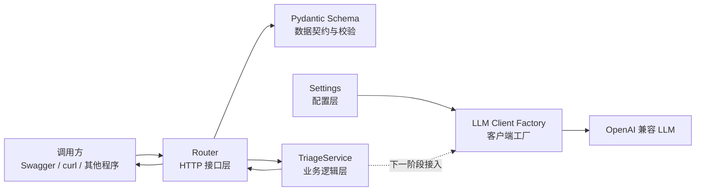

# Day 1–2 学习与开发进度

记录日期：2026-08-05

项目名称：Robot Incident Triage API

## 1. 当前阶段目标

Day 1–2 的目标是建立现代 AI 应用服务的最小工程骨架。


- 开发环境可以复现。
- FastAPI 服务可以稳定启动。
- API 路由具有清晰分层。
- 请求和响应具有明确的数据契约。
- 配置和密钥不写死在业务代码中。
- LLM 客户端不会在模块导入时创建。
- 后续可以通过依赖注入替换真实服务和测试服务。

## 2. 当前架构



当前已经打通：

```text
调用方
  → FastAPI Router
  → Pydantic 校验
  → TriageService
  → TriageResponse
  → JSON 响应
```

LLM 客户端工厂已经创建，但尚未注入 `TriageService`。这将在 Day 3–4 完成。

## 3. 当前完成情况

### 工程环境

- [x] 使用 Conda 创建 Python 3.11 环境
- [x] 当前 Python 版本为 3.11.15
- [x] 创建 `requirements.txt`
- [x] 安装全部项目依赖
- [x] 使用 `python -m pip check` 验证依赖
- [x] 创建 `.gitignore`
- [x] 创建 `.env.example`
- [x] 确认真实 `.env` 不提交到 Git
- [x] 创建项目 `README.md`
- [x] 创建工程基线文档

### FastAPI 基线

- [x] 创建 FastAPI 应用
- [x] 使用 Uvicorn 启动服务
- [x] 实现 `GET /health`
- [x] 验证 `/health` 返回 `200 OK`
- [x] 验证 Swagger UI 可以访问
- [x] 使用应用工厂 `create_app()`

### 分层结构

- [x] 创建 `routers/`
- [x] 创建 `schemas/`
- [x] 创建 `services/`
- [x] 创建 `utils/`
- [x] 将 `/health` 从 `main.py` 移入独立 Router
- [x] 创建 `triage` Router
- [x] 创建 `TriageRequest`
- [x] 创建 `TriageResponse`
- [x] 创建 `TriageService`
- [x] 使用 FastAPI `Depends` 注入 Service

### 配置与 LLM 客户端

- [x] 使用 `pydantic-settings` 创建配置层
- [x] 从 `.env` 读取 LLM 配置
- [x] 使用 `SecretStr` 保护 API Key 的打印结果
- [x] 使用 `HttpUrl` 校验 Base URL
- [x] 使用 `lru_cache` 缓存 Settings
- [x] 创建 `AsyncOpenAI` 客户端工厂
- [x] 定义 `LLMConfigurationError`
- [x] 验证缺少 API Key 时返回明确错误
- [x] 确认模块导入时不会创建 LLM 客户端

## 4. 当前项目结构

```text
week-01code/
├── app/
│   ├── routers/
│   │   ├── __init__.py
│   │   ├── health.py
│   │   └── triage.py
│   ├── schemas/
│   │   ├── __init__.py
│   │   └── triage.py
│   ├── services/
│   │   ├── __init__.py
│   │   ├── llm_client.py
│   │   └── triage.py
│   ├── utils/
│   │   └── __init__.py
│   ├── __init__.py
│   └── config.py
├── docs/
│   ├── baseline.md
│   └── day1-2-progress.md
├── .env
├── .env.example
├── .gitignore
├── main.py
├── README.md
├── requirements.txt
└── week1.txt
```

`.env` 只保存在本地，不得提交到 Git。

`__pycache__/` 是 Python 自动生成的字节码缓存，已经通过 `.gitignore` 排除。

## 5. 当前依赖

`requirements.txt`：

```txt
fastapi
uvicorn[standard]
openai
pydantic-settings
pytest
pytest-asyncio
httpx
sse-starlette
```

主要职责：

| 依赖                  | 职责                    |
| ------------------- | --------------------- |
| `fastapi`           | 定义 HTTP API、路由和依赖注入   |
| `uvicorn`           | 运行 ASGI 应用并监听 HTTP 请求 |
| `openai`            | 调用 OpenAI 兼容的 LLM 服务  |
| `pydantic-settings` | 从环境变量和 `.env` 读取配置    |
| `pytest`            | 编写和运行自动化测试            |
| `pytest-asyncio`    | 测试异步函数                |
| `httpx`             | 发送 HTTP 请求并测试异步 API   |
| `sse-starlette`     | 实现 SSE 流式响应           |

当前安装的 OpenAI Python SDK 版本：

```text
openai 2.53.0
```

## 6. 当前接口

### `GET /health`

职责：判断 FastAPI 服务进程是否能够正常响应。

请求：

```http
GET /health
```

响应：

```json
{
  "status": "ok"
}
```

已验证：

```text
200 OK
```

健康检查目前不访问 LLM，避免上游模型故障导致当前 API 服务被误判为死亡。

### `POST /api/v1/triage`

职责：接收机器人故障信息，并返回故障摘要和排查建议。

当前接口已经完成结构验证，但返回的是占位结果，尚未调用真实 LLM。

有效请求示例：

```json
{
  "robot_id": "robot-001",
  "symptom": "机器人无法移动",
  "log_excerpt": "ERROR motor_controller: motor timeout"
}
```

当前响应示例：

```json
{
  "request_id": "自动生成的 UUID",
  "summary": "已接收机器人 robot-001 的故障信息，LLM 分析服务尚未接入。",
  "recommended_actions": [
    "确认日志已经完成脱敏",
    "等待后续分析服务返回结果"
  ]
}
```

已验证：

- 有效请求返回 `200 OK`。
- 缺少必填字段时返回 `422`。
- 空的 `log_excerpt` 被 Pydantic 拒绝。
- 未声明的额外字段被拒绝。
- 字符串首尾空格会自动清除。

## 7. 当前数据契约

### `TriageRequest`

必填字段：

| 字段            | 类型    | 限制         | 作用         |
| ------------- | ----- | ---------- | ---------- |
| `robot_id`    | `str` | 1～100 字符   | 标识发生故障的机器人 |
| `symptom`     | `str` | 1～1000 字符  | 描述观察到的故障现象 |
| `log_excerpt` | `str` | 1～10000 字符 | 提供脱敏后的日志片段 |

配置：

```python
model_config = ConfigDict(
    str_strip_whitespace=True,
    extra="forbid",
)
```

作用：

- 自动删除字符串首尾空格。
- 防止纯空格绕过非空校验。
- 拒绝 Schema 中没有声明的字段。
- 尽早发现客户端字段拼写错误。

### `TriageResponse`

响应字段：

| 字段                    | 类型          | 作用          |
| --------------------- | ----------- | ----------- |
| `request_id`          | `str`       | 唯一追踪本次请求    |
| `summary`             | `str`       | 返回谨慎的故障摘要   |
| `recommended_actions` | `list[str]` | 返回建议执行的排查操作 |

`request_id` 当前使用 `uuid4()` 生成。

未来同一个 `request_id` 将贯穿：

```text
Router → Service → LLM → SSE → 日志
```

## 8. 当前分层职责

### `main.py`

负责创建和装配 FastAPI 应用：

```text
FastAPI Application
├── health_router
└── triage_router
```

`main.py` 不包含具体业务逻辑。

### `routers/`

负责 HTTP 协议层工作：

- 定义请求方法和 URL。
- 声明请求与响应 Schema。
- 接收已经校验的数据。
- 调用 Service。
- 返回 HTTP 响应。

Router 不负责组织复杂提示词或直接实现 LLM 分析逻辑。

### `schemas/`

负责数据契约：

- 字段类型。
- 必填字段。
- 长度限制。
- 输入校验。
- 响应结构。
- OpenAPI 文档信息。

### `services/`

负责业务能力：

- 故障分析流程。
- 提示词组织。
- LLM 调用。
- LLM 响应解析。
- 超时与无效响应处理。

当前 `TriageService` 返回占位结果，下一阶段接入真实 LLM。

### `config.py`

负责集中管理：

- `LLM_API_KEY`
- `LLM_BASE_URL`
- `LLM_MODEL`

业务代码不直接到处调用 `os.getenv()`。

### `utils/`

用于保存通用、独立的辅助能力。

当前该目录尚未添加具体工具。不能把它当作所有“不知道放在哪里的代码”的集合。

## 9. Service 依赖注入

Router 当前通过：

```python
service: Annotated[
    TriageService,
    Depends(get_triage_service),
]
```

声明自己需要一个 `TriageService`。

其中：

- `TriageService` 是参数的真实类型。
- `Depends(get_triage_service)` 是提供给 FastAPI 的附加信息。
- FastAPI 调用 `get_triage_service()` 创建对象。
- 客户端不需要在请求 JSON 中提交 `service`。

调用过程：

```text
HTTP 请求
    ↓
FastAPI 校验 TriageRequest
    ↓
FastAPI 调用 get_triage_service()
    ↓
FastAPI 将 Service 注入 Router
    ↓
Router 调用 await service.analyze(request)
```

测试时可以使用 FastAPI 的依赖覆盖机制，将真实 Service 替换成 Fake Service。

## 10. 配置层

当前 Settings：

```python
class Settings(BaseSettings):
    llm_api_key: SecretStr | None = None
    llm_base_url: HttpUrl | None = None
    llm_model: str | None = None
```

配置来源：

```text
.env / 系统环境变量
          ↓
       Settings
          ↓
客户端工厂与 Service
```

使用 `SecretStr` 后，直接打印 API Key 会显示：

```text
**********
```

`SecretStr` 不会加密密钥，只是减少密钥被意外打印到日志的风险。

Settings 使用 `lru_cache`：

```python
@lru_cache
def get_settings() -> Settings:
    return Settings()
```

第一次调用时读取配置，之后返回缓存对象。

修改 `.env` 后需要重启服务，才能稳定读取新配置。

## 11. LLM 客户端工厂

当前客户端工厂位于：

```text
app/services/llm_client.py
```

主要接口：

```python
def create_llm_client(settings: Settings) -> AsyncOpenAI:
    ...
```

工厂负责：

- 检查 API Key。
- 从 `SecretStr` 获取真实密钥。
- 转换 Base URL。
- 设置客户端超时。
- 创建 `AsyncOpenAI`。

模型名称通过：

```python
def get_llm_model(settings: Settings) -> str:
    ...
```

单独获取，因为模型名称不是创建客户端时的参数，而是在每次模型请求中指定。

未采用下面的全局写法：

```python
client = AsyncOpenAI(...)
```

原因是全局客户端会在模块导入阶段创建，可能导致：

- 未配置密钥时整个应用无法导入。
- `/health` 受到 LLM 配置影响。
- 测试意外创建真实客户端。
- 客户端不容易替换。
- 初始化时机无法控制。

当前设计只有显式调用工厂时才会创建客户端。

## 12. 已完成的手动验证

### Python 环境

```powershell
python --version
```

结果：

```text
Python 3.11.15
```

### 依赖完整性

```powershell
python -m pip check
```

结果：

```text
No broken requirements found.
```

### 启动服务

```powershell
python -m uvicorn main:app --reload
```

### 健康检查

```powershell
curl.exe http://127.0.0.1:8000/health
```

结果：

```json
{"status":"ok"}
```

服务器日志：

```text
GET /health HTTP/1.1 200 OK
```

### Pydantic 有效数据

```powershell
python -c "from app.schemas.triage import TriageRequest; data = TriageRequest(robot_id='  robot-001  ', symptom='无法移动', log_excerpt='motor timeout'); print(data.model_dump())"
```

结果：

```text
{'robot_id': 'robot-001', 'symptom': '无法移动', 'log_excerpt': 'motor timeout'}
```

### Pydantic 无效数据

空的 `log_excerpt` 会产生：

```text
ValidationError
String should have at least 1 character
```

### LLM 模块安全导入

```powershell
python -c "import app.services.llm_client; print('导入成功，没有创建客户端')"
```

### 创建 LLM 客户端

```powershell
python -c "from app.config import get_settings; from app.services.llm_client import create_llm_client; client = create_llm_client(get_settings()); print(type(client).__name__)"
```

预期：

```text
AsyncOpenAI
```

该命令只创建客户端，不会发送网络请求，也不会产生 LLM 调用费用。

### 模拟缺少 API Key

```powershell
python -c "from app.config import Settings; from app.services.llm_client import create_llm_client; settings = Settings(_env_file=None, llm_api_key=None, llm_base_url=None, llm_model=None); create_llm_client(settings)"
```

预期错误：

```text
LLMConfigurationError: LLM_API_KEY 未配置
```

## 13. 当前阶段结论

Day 1–2 的工程骨架主体已经完成。

当前应用已经具备：

- 可运行的 FastAPI 服务。
- 清晰的 Router、Schema、Service、Config 分层。
- 严格的请求和响应契约。
- 可替换的 Service 依赖。
- 集中的环境变量管理。
- 延迟创建的异步 LLM 客户端。
- 清晰的缺少配置错误。

当前仍然没有真正调用 LLM，`POST /api/v1/triage` 返回的是占位响应。

