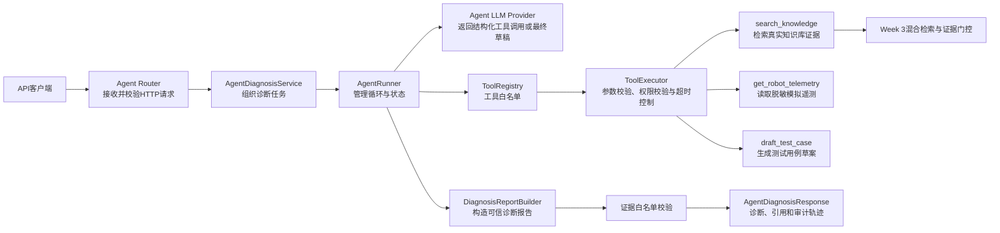
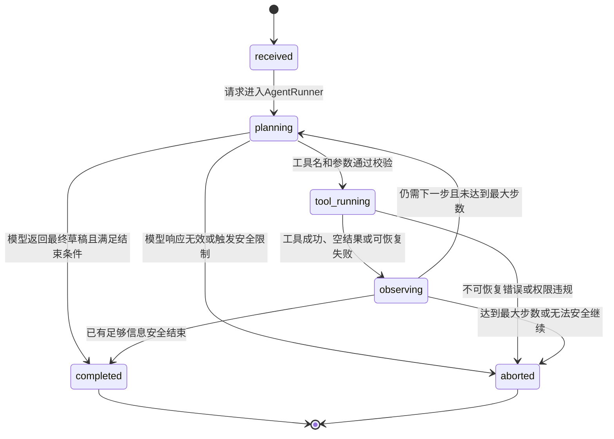
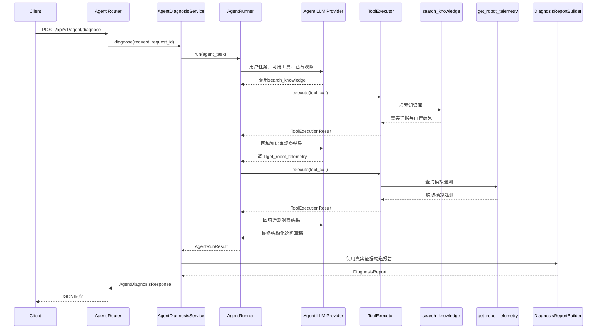

# Robot Diagnostic Agent 架构设计

## 1. 文档目的

本文档定义 Week 4 Robot Diagnostic Agent 的执行边界、状态流转、工具调用链、信任边界、终止条件和失败路径。

本周的 Agent 不直接控制真实机器人，不执行 shell、Python、任意网络请求或设备操作。Agent 只能从应用预先注册的工具中选择下一步，并且所有工具调用都必须经过名称校验、Pydantic 参数校验、权限校验和超时控制。

本文档描述的是目标架构。具体的 Pydantic Schema、工具注册表、工具执行器和 AgentRunner 将在后续模块中实现。

## 2. Week 3 与 Week 4 的关系

### 2.1 Week 3 固定诊断链路

Week 3 的 `DiagnosisService` 按照程序提前规定的顺序执行：

```text
DiagnosisRequest
→ 构造检索问题和检索范围
→ GatedHybridRetriever
→ 证据门控
→ DiagnosisDraftProvider
→ DiagnosisReportBuilder
→ DiagnosisReport
```

这条链路适合一次检索后生成诊断。程序员已经提前确定了每一个步骤，因此 LLM 不能选择是否需要查询其他信息。

### 2.2 Week 4 受控 Agent 链路

Week 4 在现有诊断能力上增加 Agent 编排层：

```text
AgentDiagnosisRequest
→ AgentDiagnosisService
→ AgentRunner
→ LLM选择已注册工具
→ ToolExecutor执行工具
→ Agent观察工具结果
→ 继续规划或结束
→ DiagnosisReportBuilder
→ AgentDiagnosisResponse
```

Agent 可以根据任务选择先检索知识库、查询模拟遥测或生成测试用例草案，但不能绕过工具注册表和证据白名单。

## 3. 总体组件



### 3.1 Agent Router

Agent Router 负责：

1. 声明 `POST /api/v1/agent/diagnose`；
2. 让 FastAPI 使用 Pydantic 校验请求体；
3. 通过 `Depends` 获取 `AgentDiagnosisService`；
4. 从 `Request.state` 读取 `request_id`；
5. 调用 Service 并返回响应。

Router 不实现规划、工具执行、检索、LLM 调用或报告组装。

### 3.2 AgentDiagnosisService

AgentDiagnosisService 是 Agent 业务入口。

它负责：

1. 将 API 请求转换成 Agent 任务；
2. 调用 `AgentRunner`；
3. 接收 Agent 执行结果；
4. 复用 Week 3 的结构化诊断和引用白名单；
5. 构造最终 `AgentDiagnosisResponse`。

Service 不允许根据工具名字动态导入 Python 函数。

### 3.3 AgentRunner

AgentRunner 是状态循环的控制者。

它负责：

1. 初始化执行状态；
2. 调用 Agent LLM Provider；
3. 解析结构化工具调用；
4. 将工具调用交给 ToolExecutor；
5. 保存工具结果和审计事件；
6. 判断是否继续下一步；
7. 检查最大步数和终止条件；
8. 返回完整、部分或中止的执行结果。

LLM 只能提出工具调用请求。是否执行由 AgentRunner、ToolRegistry 和 ToolExecutor 共同决定。

### 3.4 ToolRegistry

ToolRegistry 是工具白名单。

它保存经过应用注册的工具定义和处理器。模型返回的工具名只有在注册表中存在时才可能执行。

ToolRegistry 禁止：

- 根据模型返回值使用 `eval()`；
- 根据模型返回值使用 `exec()`；
- 根据任意字符串动态导入模块；
- 在注册表外查找同名函数；
- 执行 shell 或设备控制命令。

### 3.5 ToolExecutor

ToolExecutor 负责统一执行已注册工具。

执行顺序是：

```text
接收ToolCall
→ 查询ToolRegistry
→ 校验工具是否存在
→ 使用Pydantic校验参数
→ 检查风险级别和只读权限
→ 应用单工具超时
→ 调用异步工具处理器
→ 校验工具输出
→ 返回ToolExecutionResult
```

ToolExecutor 不负责决定下一步调用哪个工具，该决策由 AgentRunner 发起并由安全规则约束。

## 4. Agent 状态模型

### 4.1 状态定义

Agent 生命周期使用以下状态：

| 状态 | 含义 | 是否为终态 |
|---|---|---|
| `received` | 请求已经通过 API 数据校验并进入 Agent Service | 否 |
| `planning` | Agent 正在根据任务和已有观察决定下一步 | 否 |
| `tool_running` | 一个经过校验的工具正在执行 | 否 |
| `observing` | 工具结果已经返回，Agent 正在记录和评估结果 | 否 |
| `completed` | Agent 正常结束执行循环 | 是 |
| `aborted` | Agent 因安全限制或不可恢复错误中止 | 是 |

### 4.2 状态流转



状态转换只能由 AgentRunner 中明确的 Python 规则执行。用户输入、文档正文、遥测内容和 LLM 自然语言都不能直接修改状态。

## 5. Agent 状态与诊断状态的区别

Agent 执行状态和最终诊断状态是两套不同概念。

### 5.1 Agent 执行状态

Agent 执行状态描述循环是否正常结束：

- `completed`：循环按照规则正常结束；
- `aborted`：循环因技术或安全原因被迫停止。

### 5.2 DiagnosisReport 状态

Week 3 的 `DiagnosisReport.status` 描述证据完整程度：

- `completed`：证据足以形成完整诊断；
- `partial`：可以提供部分结论，但仍缺少必要信息；
- `abstained`：证据不足、冲突或置信度太低，拒绝提供原因和检查动作。

因此可能出现：

| Agent 状态 | DiagnosisReport 状态 | 含义 |
|---|---|---|
| `completed` | `completed` | Agent 正常结束，并形成完整诊断 |
| `completed` | `partial` | Agent 正常结束，但证据只能支持部分诊断 |
| `completed` | `abstained` | Agent 正常确认当前证据不足 |
| `aborted` | `partial` | Agent 异常中止，但保留了已经确认的部分信息 |
| `aborted` | `abstained` | Agent 中止且没有足够证据形成诊断 |

Agent 的 `completed` 不能被解释成“故障已经确认”或“诊断一定完整”。

## 6. 正常执行时序



## 7. 数据来源与信任边界

### 7.1 应用控制数据

以下内容由应用控制，不允许用户、文档、遥测或 LLM 修改：

- System Prompt；
- ToolRegistry；
- 工具权限；
- 最大执行步数；
- 单工具超时；
- 风险策略；
- 证据门控；
- 引用白名单；
- 终止条件。

### 7.2 不可信数据

以下内容全部视为不可信数据：

- 用户提交的现象；
- 用户提交的日志；
- 文档正文；
- 模拟遥测文本；
- 工具返回文本；
- LLM 返回的自然语言；
- LLM 返回的工具参数。

不可信不等于禁止使用，而是必须经过数据校验，并且不能改变应用规则。

### 7.3 可以进入最终诊断的数据

最终诊断只能使用：

1. 明确标记为 `user_report` 或 `log_excerpt` 的用户输入；
2. 明确标记为 `simulated_telemetry` 的模拟遥测；
3. `search_knowledge` 本次真实返回的知识库证据；
4. 根据上述信息生成并通过 Schema 校验的诊断草稿；
5. 通过证据白名单检查的引用 ID。

LLM 不能直接生成真实 Chunk 元数据、文件名、页码、相似度或遥测来源。

## 8. 终止条件

### 8.1 正常完成

满足以下条件时可以进入 `completed`：

- LLM 返回符合最终草稿 Schema 的结果；
- 没有待执行的工具调用；
- 所有引用都能在本次工具结果白名单中找到；
- 高风险结论满足人工确认要求；
- 当前结果可以明确标记为 `completed`、`partial` 或 `abstained`。

### 8.2 安全中止

以下情况必须进入 `aborted`：

- 达到最大执行步数；
- 请求调用未知工具；
- 请求执行注册表之外的能力；
- 重复调用形成无进展循环；
- LLM 连续返回无效结构；
- 发生不可恢复的工具或上游异常；
- 用户要求执行真实机器人控制；
- 工具调用试图越过只读权限；
- 提示注入试图修改系统规则；
- 无法在既定限制内生成稳定结果。

### 8.3 部分结果

已经取得可信证据，但后续工具失败时，可以返回部分结果。

部分结果必须：

- 保留已经完成的工具步骤；
- 只保留已经验证的事实；
- 列出缺失信息；
- 不把未执行步骤描述成已完成；
- 不为了完成任务降低证据门槛。

## 9. 失败路径

| 失败场景 | 稳定处理方式 |
|---|---|
| 未知工具 | 不执行，记录 `unknown_tool` |
| 参数不合法 | 不执行，记录 `invalid_tool_arguments` |
| 工具超时 | 停止该工具，记录 `tool_timeout` |
| 工具返回空结果 | 记录 `empty_result`，允许重新规划 |
| 重复调用 | 记录 `duplicate_tool_call`，阻止无限循环 |
| 达到最大步数 | 记录 `max_steps_exceeded` 并停止 |
| LLM 超时 | 记录 `llm_timeout`，保留已有步骤 |
| LLM 返回无效结构 | 记录 `invalid_llm_response` |
| 工具上游失败 | 记录稳定错误码，不公开底层响应 |
| 提示注入 | 当作普通数据，不改变系统规则 |
| 高风险执行请求 | 拒绝执行，并要求人工或有资质人员处理 |

错误码用于程序判断和评测，公开错误消息用于向用户解释。两者不能依赖解析自然语言日志。

## 10. 执行轨迹

每个 Agent 事件至少记录：

- `step_id`；
- `event_type`；
- `tool_name`；
- 脱敏后的输入摘要；
- 脱敏后的结果摘要；
- `status`；
- `duration_ms`；
- `error_code`。

轨迹记录系统实际做了什么，不记录模型私有思维链。

轨迹不得包含：

- API Key；
- 完整敏感日志；
- 完整 Prompt；
- 未脱敏遥测；
- 模型私有推理过程；
- 未经筛选的上游响应体。

## 11. 安全不变量

无论用户输入、文档、工具结果或 LLM 输出什么内容，以下规则始终成立：

1. 只能执行 ToolRegistry 中的工具；
2. 工具参数必须通过 Pydantic 校验；
3. 所有工具都有超时限制；
4. Agent 有最大步数限制；
5. 不执行 shell、任意 Python、任意网络或设备控制；
6. 不允许工具结果修改系统规则；
7. 不允许 Agent 伪造知识库证据；
8. 高风险检查必须要求有资质人员确认；
9. 证据不足时必须 `partial` 或 `abstained`；
10. 已完成步骤和失败原因必须可审计。

## 12. 计划中的模块边界

后续实现预计使用以下模块结构：

```text
app/
├── agent/
│   ├── __init__.py
│   ├── registry.py
│   ├── executor.py
│   ├── runner.py
│   └── tools/
│       ├── __init__.py
│       ├── knowledge.py
│       ├── telemetry.py
│       └── test_case.py
├── schemas/
│   └── agent.py
├── services/
│   └── agent_diagnosis.py
└── routers/
    └── agent.py
```

各模块职责为：

- `app/schemas/agent.py`：定义 Agent 请求、状态、工具调用、工具结果、轨迹和响应的数据契约；
- `app/agent/registry.py`：保存工具白名单和工具定义；
- `app/agent/executor.py`：执行名称、参数、权限、超时和输出校验；
- `app/agent/runner.py`：实现 Agent 状态循环；
- `app/agent/tools/knowledge.py`：适配 Week 3 的知识库检索能力；
- `app/agent/tools/telemetry.py`：读取内存中的脱敏模拟遥测；
- `app/agent/tools/test_case.py`：生成测试用例草案，不执行测试；
- `app/services/agent_diagnosis.py`：编排 AgentRunner 和 DiagnosisReport；
- `app/routers/agent.py`：暴露 HTTP 接口，不包含业务实现。