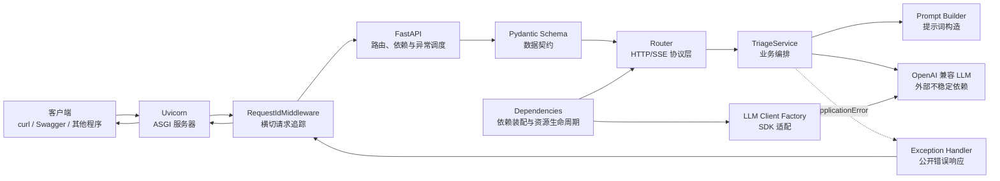

# Week 1 代码技术细节全解

## 1. 文档目标与当前结论

这份文档用于让读者仅通过一份 Markdown，就能理解 Week 1 代码的组成、运行方式、数据流、异常流、流式协议和测试方法。

当前系统提供三个接口：

| 方法和路径 | 作用 | 响应方式 |
|---|---|---|
| `GET /health` | 判断当前 API 进程能否响应 | 普通 JSON |
| `POST /api/v1/triage` | 根据机器人故障信息生成摘要和建议 | 完整 JSON |
| `POST /api/v1/triage/stream` | 逐步返回模型生成的文本 | SSE 事件流 |

Week 1 的重点不是“写一个调用模型的函数”，而是建立一个可维护的 AI 应用服务边界：

```text
HTTP 与协议层
    ↓
输入/输出数据契约
    ↓
业务编排层
    ↓
提示词与 LLM SDK 适配层
    ↓
外部 OpenAI 兼容 LLM
```

配套能力还包括：

- 集中配置与密钥保护；
- FastAPI 依赖注入；
- 异步网络调用；
- 请求 ID 追踪；
- 应用异常与 HTTP/SSE 错误的统一映射；
- Fake、Mock 和无网络自动化测试；
- 普通响应与流式响应的不同生命周期处理。

当前代码已重新验证：

```text
21 passed in 4.55s
```

验证命令使用 `-B` 和 `-p no:cacheprovider`，只为避免在副本目录生成字节码和 pytest 缓存，不会改变测试逻辑：

```powershell
python -B -m pytest -p no:cacheprovider tests -q
```

## 2. 整体架构

### 2.1 组件关系



### 2.2 为什么这样分层

| 层 | 负责什么 | 不应该负责什么 |
|---|---|---|
| `main.py` | 创建应用并装配组件 | 具体故障分析业务 |
| `middleware/` | 所有请求共有的横切行为 | 某一个接口独有的业务规则 |
| `routers/` | HTTP 方法、路径、状态和响应协议 | 直接拼复杂提示词、解析 SDK 对象 |
| `schemas/` | 输入、输出及内部数据结构校验 | 调网络或执行业务流程 |
| `dependencies.py` | 把配置、客户端、Service 连接起来 | 实现分析算法 |
| `services/` | 业务编排、提示词、LLM 调用和解析 | 关心具体 HTTP Response |
| `config.py` | 从环境读取并校验配置 | 把密钥散落到业务代码中 |
| `errors.py` | 定义应用内部错误语义 | 决定 HTTP 或 SSE 的具体表现形式 |
| `exception_handlers.py` | 把内部错误翻译成公开 HTTP 错误 | 调用 LLM 或处理业务数据 |

这样设计的核心是“变化隔离”：

- HTTP 路径改变时，主要修改 Router；
- 输入格式改变时，主要修改 Schema；
- 模型供应商或调用参数改变时，主要修改 LLM 适配代码；
- 业务提示词改变时，主要修改 `prompts.py`；
- 测试时可替换 Service 或 LLM 客户端，而不必启动真实网络。

这也为 Week 2 的 RAG 留出了位置。RAG 检索属于业务能力，通常由 `TriageService` 调用独立的 Retriever，而不是写进 Router 或 Middleware：

```text
Router
  ↓
TriageService
  ├─ Retriever / RAG（Week 2）
  ├─ Prompt Builder
  └─ LLM Client
```

## 3. 实际项目结构

```text
week-02code/
├── app/
│   ├── middleware/
│   │   ├── __init__.py
│   │   └── request_id.py
│   ├── routers/
│   │   ├── __init__.py
│   │   ├── health.py
│   │   └── triage.py
│   ├── schemas/
│   │   ├── __init__.py
│   │   ├── error.py
│   │   ├── stream.py
│   │   └── triage.py
│   ├── services/
│   │   ├── __init__.py
│   │   ├── llm_client.py
│   │   ├── prompts.py
│   │   └── triage.py
│   ├── utils/
│   │   └── __init__.py
│   ├── __init__.py
│   ├── config.py
│   ├── dependencies.py
│   ├── errors.py
│   └── exception_handlers.py
├── docs/
│   ├── baseline.md
│   ├── sse_protocol.md
│   ├── test-report.md
│   └── 工程复盘.md
├── samples/
│   ├── insufficient-evidence.json
│   ├── normal-operation.json
│   └── upstream-failure-request.json
├── tests/
│   ├── test_api_contract.py
│   ├── test_error_responses.py
│   ├── test_service_errors.py
│   ├── test_service_responses.py
│   └── test_stream.py
├── .env.example
├── .gitignore
├── main.py
├── README.md
├── requirements.txt
├── week1.txt
└── week2.txt
```

`__init__.py` 让目录成为可导入的 Python 包，并用模块文档字符串说明包的职责。当前 `utils/` 只有说明文件，没有实际工具；不能把所有“不知道放在哪里”的代码都放进去。

## 4. 运行代码前必须理解的 Python 概念

### 4.1 模块、包与导入

- 一个 `.py` 文件通常是一个模块，例如 `app.config` 对应 `app/config.py`。
- 含 `__init__.py` 的目录可作为包，例如 `app.services`。
- `from app.routers.health import router as health_router` 导入 `router`，并在当前模块改名为 `health_router`，避免和其他 Router 的同名变量冲突。
- 导入模块会执行模块顶层代码。因此项目刻意不在导入阶段创建 `AsyncOpenAI`，防止缺少密钥时连 `/health` 都无法启动。

### 4.2 类型标注

类型标注主要服务于阅读、编辑器提示、静态检查和 FastAPI/Pydantic 的运行时解析：

| 写法 | 含义 |
|---|---|
| `str` | 字符串 |
| `str | None` | 字符串或 `None`，即配置可以缺失 |
| `list[str]` | 元素均为字符串的列表 |
| `dict[str, object]` | 键为字符串，值可为任意对象的字典 |
| `tuple[int, str, str]` | 固定三个位置的元组 |
| `type[ApplicationError]` | `ApplicationError` 类或其子类本身，不是异常实例 |
| `Literal["completed"]` | 只能取固定字符串 `completed` |
| `Annotated[T, Depends(f)]` | 真实类型是 `T`，同时附加 FastAPI 依赖元数据 |
| `AsyncIterator[str]` | 可通过 `async for` 逐个取得字符串的异步迭代器 |
| `-> None` | 函数没有有意义的返回值 |

Python 本身通常不会仅凭普通类型标注阻止错误参数；Pydantic 和 FastAPI 会主动读取部分标注并据此校验或注入。

### 4.3 `async`、`await`、`async for`、`async with`

- `async def` 定义协程函数。调用后先得到协程对象，必须 `await` 才真正等待它执行完成。
- `await` 用于等待异步操作，例如网络请求、关闭客户端、检查连接。等待期间事件循环可以运行其他任务，而不是让整个线程一直空等。
- `async for` 消费异步迭代器。每个 LLM 分块可能要等待网络到达，因此不能使用普通 `for`。
- `async with` 使用异步上下文管理器。进入和退出可能都需要异步操作，例如打开和关闭 HTTP 流。

“异步”不等于自动并行，也不等于函数会更快；它主要提高大量 I/O 等待场景下的并发利用率。

### 4.4 `yield` 与异步生成器

普通 `return` 一次性结束函数；`yield` 产生一个值后暂停，并保留局部变量和执行位置，下次迭代时继续。

在 `async def` 中使用 `yield` 会形成异步生成器：

```python
async def example():
    # 第一次迭代得到第一段，然后函数暂停。
    yield "第一段"

    # 第二次迭代才继续执行并得到第二段。
    yield "第二段"
```

本项目有两种不同用途的 `yield`：

1. `get_llm_client()` 中的依赖 `yield`：把客户端交给下游，响应结束后进入 `finally` 清理资源。
2. `stream_analysis()` 和 `event_generator()` 中的流式 `yield`：逐段向 Router 或客户端传递内容。

### 4.5 装饰器

`@装饰器` 会在函数定义完成后，把函数登记或包装起来。

例如：

```python
@router.get("/health")
async def health_check():
    ...
```

这里不是每次请求才“执行装饰器文本”，而是在模块导入、函数定义时调用 `router.get("/health")` 生成装饰器，再把 `health_check` 登记到 Router 的路由表。请求到达后 FastAPI 根据方法和路径找到已登记的函数。

`@pytest.mark.asyncio` 则给测试函数添加 pytest 标记，让插件用事件循环执行异步测试。

### 4.6 `try`、`except`、`finally` 与异常链

- `try`：执行可能失败的代码。
- `except 某异常`：只处理指定错误，不使用会掩盖 Bug 的裸 `except:`。
- `finally`：无论成功或异常都会执行，适合资源清理。
- `raise 新异常(...) from exc`：转换异常，同时保留原异常为 `__cause__`，日志和调试器仍能看到底层原因。

## 5. 依赖库及当前实际版本

`requirements.txt` 声明了直接依赖，但没有锁定版本。当前 Conda 环境实际安装的是：

| 包 | 当前版本 | 本项目用途 |
|---|---:|---|
| `fastapi` | 0.141.1 | API、Router、依赖注入、异常处理、OpenAPI |
| `starlette` | 1.3.1 | FastAPI 底层 ASGI、Request、Response、Middleware |
| `uvicorn` | 0.52.1 | 监听网络并运行 ASGI 应用 |
| `openai` | 2.53.0 | `AsyncOpenAI` 和 OpenAI 兼容 API 类型/异常 |
| `pydantic` | 2.13.4 | 数据模型、校验、序列化 |
| `pydantic-settings` | 2.14.2 | 环境变量和 `.env` 配置模型 |
| `pytest` | 9.1.1 | 测试收集、参数化、断言和报告 |
| `pytest-asyncio` | 1.4.0 | 在 pytest 中运行异步测试 |
| `httpx` | 0.28.1 | API 测试客户端及 SDK 异常测试所需 Request |
| `sse-starlette` | 3.4.6 | SSE Response 与事件编码 |
| `anyio` | 4.14.2 | FastAPI/Starlette/httpx 的异步兼容基础设施，属间接依赖 |

`uvicorn[standard]` 中的方括号是 extra，表示在 Uvicorn 基础上安装官方推荐的附加依赖，以获得更完整的重载、协议和性能支持。

## 6. `main.py`：应用装配入口

### 6.1 `FastAPI` 对象

```python
application = FastAPI(
    title="Robot Incident Triage API",
    version="0.1.0",
)
```

`FastAPI(...)` 创建 ASGI 应用对象：

- `title` 和 `version` 会进入 OpenAPI Schema，并显示在 Swagger UI；
- 应用对象保存路由、依赖覆盖、异常处理器和 Middleware 配置；
- 它最终可被 Uvicorn 当作异步可调用对象执行。

### 6.2 应用工厂 `create_app()`

```python
def create_app() -> FastAPI:
    ...
```

应用工厂把“怎样组装应用”集中到一个函数。相比所有逻辑散落在模块顶层，它更容易：

- 在测试或未来部署中创建独立应用实例；
- 控制组件注册顺序；
- 避免把业务逻辑放进启动文件。

### 6.3 `add_exception_handler()`

```python
application.add_exception_handler(
    ApplicationError,
    application_error_handler,
)
```

它建立映射：任何传播到 FastAPI 异常层的 `ApplicationError` 或其子类，都交给 `application_error_handler(request, exc)` 生成响应。

注册处理器不等于立即调用。它体现控制反转：框架掌握请求生命周期，在异常发生时回调我们提供的函数。

### 6.4 `add_middleware()`

```python
application.add_middleware(RequestIdMiddleware)
```

它把 Middleware 类登记到应用配置。Starlette 构建 Middleware 栈后，请求到达时会自动调用其实例。代码中不需要手工写 `middleware.dispatch(...)`。

若以后注册多个用户 Middleware，当前 Starlette 实现表现为“后注册的在更外层”：

```python
application.add_middleware(A)
application.add_middleware(B)
```

请求方向大致为 `B → A → Router`，响应方向为 `Router → A → B`。当前只有一个自定义 Middleware，因此不存在自定义层之间的顺序冲突。

### 6.5 `include_router()`

```python
application.include_router(health_router)
application.include_router(triage_router)
```

`include_router()` 把 `APIRouter` 中已经登记的 Route 合并到主应用路由表。Router 只是路由集合，不是独立服务器。

### 6.6 `app = create_app()` 与 `main:app`

Uvicorn 命令：

```powershell
python -m uvicorn main:app --reload
```

含义：

- `python -m uvicorn`：让当前 Python 环境以模块方式运行 Uvicorn，避免命令指向其他环境；
- `main`：导入 `main.py` 模块；
- `app`：从模块中取得名为 `app` 的 ASGI 对象；
- `--reload`：开发时监控文件变化并重启子进程，不适合生产部署。

Uvicorn 负责 socket、HTTP 解析和 ASGI 调用；FastAPI 负责应用层路由、校验、依赖和响应。

## 7. `app/config.py`：集中配置

### 7.1 `Settings(BaseSettings)`

`BaseSettings` 是 Pydantic Settings 提供的配置模型。创建 `Settings()` 时，它会综合初始化参数、环境变量和 `.env` 内容，再按照字段类型校验。

当前字段：

```python
llm_api_key: SecretStr | None = None
llm_base_url: HttpUrl | None = None
llm_model: str | None = None
```

- 字段名 `llm_api_key` 在 `case_sensitive=False` 下可读取 `LLM_API_KEY`；
- `None` 允许应用在缺少 LLM 配置时仍启动并提供 `/health`；
- 真正进入 LLM 链路时再由工厂函数给出明确配置错误。

### 7.2 `SettingsConfigDict`

```python
model_config = SettingsConfigDict(
    env_file=".env",
    env_file_encoding="utf-8",
    case_sensitive=False,
    str_strip_whitespace=True,
    extra="ignore",
)
```

每项含义：

- `env_file=".env"`：从当前工作目录寻找 `.env`；
- `env_file_encoding="utf-8"`：用 UTF-8 读取；
- `case_sensitive=False`：配置名不区分大小写；
- `str_strip_whitespace=True`：清理字符串配置首尾空格；
- `extra="ignore"`：`.env` 中有当前模型未声明的变量时忽略，而不是让整个应用失败。

注意：`.env` 相对路径依赖进程工作目录。项目命令要求在项目根目录启动，就是为了让它稳定找到 `.env`。

### 7.3 `SecretStr`

`SecretStr` 是“减少意外显示”的包装类型：直接打印通常得到 `**********`。真实值要显式调用：

```python
settings.llm_api_key.get_secret_value()
```

它不是加密，不会阻止拿到对象的代码读取密钥，也不能替代操作系统密钥管理。它只是降低日志、调试打印和模型 `repr` 意外泄密的概率。

### 7.4 `HttpUrl`

`HttpUrl` 会检查值是否像有效的 HTTP/HTTPS URL。SDK 接受字符串，因此客户端工厂最终使用 `str(settings.llm_base_url)` 转换。

### 7.5 `@lru_cache`

```python
@lru_cache
def get_settings() -> Settings:
    return Settings()
```

`lru_cache` 来自 Python 标准库 `functools`。无参数函数的参数组合永远相同，所以第一次调用后，后续调用返回缓存中的同一个 Settings 对象：

- 避免每个请求重新解析 `.env`；
- 保证同一进程的配置视图稳定；
- 修改 `.env` 后通常要重启进程；
- 测试如果修改环境并再次调用，需要考虑 `get_settings.cache_clear()`，当前测试通过直接构造 `Settings(_env_file=None, ...)` 避免此问题。

## 8. `app/errors.py`：应用错误语义

异常继承关系：

```text
Exception
  └─ RuntimeError
      └─ ApplicationError
          ├─ LLMConfigurationError
          ├─ LLMTimeoutError
          ├─ LLMUpstreamError
          └─ InvalidLLMResponseError
```

为什么不直接在 Service 抛 `HTTPException`：

- Service 是业务层，不应绑定 HTTP；未来它也可能被任务队列、CLI 或其他协议调用；
- `LLMTimeoutError` 表达“发生了什么”，异常处理器再决定 HTTP 中表现为 `504`、SSE 中表现为 `error`；
- 只统一捕获 `ApplicationError`，不会把 `TypeError`、`AttributeError` 等程序 Bug 伪装成正常业务失败。

各异常含义：

| 异常 | 语义 |
|---|---|
| `LLMConfigurationError` | API Key 或模型名缺失/无效 |
| `LLMTimeoutError` | 等待上游 LLM 超时 |
| `LLMUpstreamError` | 连接失败或上游返回错误状态 |
| `InvalidLLMResponseError` | 响应为空、没有候选项、不是 JSON 或结构错误 |

这些类目前没有自定义方法，主要价值是提供稳定、可精确捕获的错误类型。

## 9. `app/exception_handlers.py`：异常到 HTTP 的翻译

### 9.1 `ErrorMetadata`

```python
ErrorMetadata = tuple[int, str, str]
```

这是类型别名，三个位置依次是：HTTP 状态码、公开错误码、公开消息。它不会创建新运行时类型。

### 9.2 `ERROR_METADATA`

| 应用异常 | HTTP | 公开 code | 公开 message |
|---|---:|---|---|
| `LLMConfigurationError` | 503 | `llm_configuration_error` | LLM 服务未正确配置 |
| `LLMTimeoutError` | 504 | `llm_timeout` | LLM 服务响应超时 |
| `LLMUpstreamError` | 502 | `llm_upstream_error` | LLM 上游服务暂时不可用 |
| `InvalidLLMResponseError` | 502 | `invalid_llm_response` | LLM 返回了无法处理的响应 |

- `502 Bad Gateway`：当前 API 作为网关/调用方向上游请求，但上游失败或响应不可用；
- `503 Service Unavailable`：当前服务依赖的配置未就绪；
- `504 Gateway Timeout`：上游在规定时间内没有响应。

### 9.3 `get_error_metadata()`

```python
return ERROR_METADATA.get(
    type(exc),
    (500, "application_error", "应用处理请求时发生错误"),
)
```

- `type(exc)` 取得异常实例的具体类；
- `dict.get(key, default)` 有映射就返回映射，没有则返回安全兜底；
- 多元组可直接解包为 `status_code, error_code, public_message`。

一个重要细节：这里按 `type(exc)` 精确查找，而不是按 `isinstance()` 查找。若未来新增 `LLMTimeoutError` 的子类但未登记，它会落到 500 兜底，而不会自动继承 504 映射。

### 9.4 `application_error_handler()`

签名：

```python
async def application_error_handler(
    request: Request,
    exc: ApplicationError,
) -> JSONResponse:
```

FastAPI 在异常匹配后传入当前 Request 和异常实例。

处理步骤：

1. 调用 `get_error_metadata(exc)` 得到公开 HTTP 信息；
2. 用 `getattr(request.state, "request_id", "unavailable")` 安全读取追踪 ID；
3. `logger.warning()` 在服务端记录请求 ID、异常类型和内部详情；
4. 构造 `ErrorDetail` 和 `ErrorResponse`；
5. `model_dump(mode="json")` 转成可 JSON 序列化字典；
6. `JSONResponse(status_code=..., content=...)` 编码响应。

`getattr()` 的第三个参数是属性不存在时的默认值，可防止错误处理器自身再因 `request_id` 缺失而抛 `AttributeError`。

日志写法：

```python
logger.warning(
    "application_error request_id=%s type=%s detail=%s",
    request_id,
    type(exc).__name__,
    str(exc),
)
```

`%s` 由 logging 在真正输出时延迟格式化，比提前构造 f-string 更符合日志库习惯。`__name__` 是当前模块名，便于日志定位来源。

内部错误文本只写日志，客户端收到固定安全消息，防止泄漏 URL、供应商响应、密钥或实现细节。

## 10. `app/middleware/request_id.py`：请求追踪

### 10.1 Middleware 的位置

Middleware 包裹所有 HTTP 路由，适合“横切关注点”，例如请求 ID、访问日志、CORS、认证和耗时统计。

当前请求/响应方向：

```text
客户端请求
  ↓
RequestIdMiddleware 请求阶段
  ↓
FastAPI / 依赖 / Router / Service
  ↓
RequestIdMiddleware 响应阶段
  ↓
客户端响应
```

### 10.2 `BaseHTTPMiddleware`

`RequestIdMiddleware` 继承 Starlette 的 `BaseHTTPMiddleware`，并覆盖：

```python
async def dispatch(
    self,
    request: Request,
    call_next: RequestResponseEndpoint,
) -> Response:
```

- `request`：当前 HTTP 请求对象；
- `call_next`：框架提供的可调用对象，类型近似 `Callable[[Request], Awaitable[Response]]`；
- `response`：下游返回的 Starlette Response。

调用 `await call_next(request)` 才会把请求交给更内层 Middleware、FastAPI、依赖和 Router。如果身份验证 Middleware 发现身份不合法，可以不调用 `call_next`，而是直接 `return JSONResponse(status_code=401, ...)`。这叫短路，不是无响应地忽略请求。

### 10.3 `uuid4()`

`uuid4()` 产生随机 UUID 对象；`str()` 转成适合日志、JSON 和 Header 的文本，例如：

```text
db265a7b-16e3-4b12-8e7d-7a03cec766d6
```

UUID4 的目的主要是足够低碰撞概率的关联标识，不是按时间排序的业务编号，也不包含用户身份。

### 10.4 `request.state`

```python
request.state.request_id = request_id
```

`Request` 没有预定义的 `request_id` 字段。`state` 是 Starlette 为单次请求提供的动态属性容器，可安全放置本次请求上下文。

不要直接写 `request.request_id`；框架约定的扩展位置是 `request.state`。每个请求有自己的 `state`，不会把两个并发请求的 ID 混在一起。

### 10.5 `response.headers`

```python
response.headers["X-Request-ID"] = request_id
```

`headers` 是可修改的、大小写不敏感的响应头容器。`X-Request-ID` 不是 Response 预定义属性，而是代码新增的自定义 HTTP Header。若同名 Header 已存在，此赋值会覆盖。

客户端、服务端日志、JSON 响应和 SSE 事件都可借同一个 ID 关联一次请求。

### 10.6 Middleware 的边界

- 普通响应中，`await call_next()` 得到 Response 后可以增加 Header；
- 对 SSE/StreamingResponse 来说，得到 Response 对象不代表整个流体已经发送完成，后续生成器仍会持续工作；
- 如果 `call_next()` 抛出未被内层处理的异常，当前代码不会执行设置 Header 的下一行；
- 当前可预期 `ApplicationError` 会被 FastAPI 异常处理层转换为 Response，因此通常仍能加 `X-Request-ID`；
- 如需精确观察每一个 ASGI 响应体分块或流真正发送结束，要使用更底层的纯 ASGI Middleware 包装 `send`。

## 11. `app/schemas/triage.py`：请求、成功响应与 LLM 契约

### 11.1 Pydantic `BaseModel`

继承 `BaseModel` 后，类同时具备：

- 从 Python/JSON 数据构造对象；
- 类型和约束校验；
- 字段错误定位；
- 转字典、JSON；
- 生成 JSON Schema，FastAPI 再用于 OpenAPI 文档。

### 11.2 `TriageRequest`

请求字段：

| 字段 | 类型 | 约束 | 含义 |
|---|---|---|---|
| `robot_id` | `str` | 1～100 字符 | 机器人标识 |
| `symptom` | `str` | 1～1000 字符 | 观察到的现象 |
| `log_excerpt` | `str` | 1～10000 字符 | 已脱敏日志片段 |

```python
model_config = ConfigDict(
    str_strip_whitespace=True,
    extra="forbid",
)
```

- `str_strip_whitespace=True` 会先把字符串首尾空格移除，所以纯空格最终会变成空串并触发 `min_length=1`；
- `extra="forbid"` 拒绝未声明字段，可及早发现拼写错误，也避免客户端偷偷把 `api_key` 等数据混入请求。

`Field(...)` 的参数：

- `min_length`、`max_length`：运行时约束；
- `description`：进入 OpenAPI 文档；
- `examples`：在 Swagger 中提示合法示例。

请求不满足契约时，FastAPI 不会调用 Router 函数或 `service.analyze()`，而会返回 `422 Unprocessable Entity`，因此不会消耗 LLM Token。需要注意，FastAPI 内部可能先解析独立依赖、再汇总请求体校验结果，所以“不会调用业务方法”不等于“所有依赖提供者都一定没有执行”。

### 11.3 `TriageResponse`

成功响应：

```text
request_id: str
summary: str
recommended_actions: list[str]
```

- `extra="forbid"` 保持服务输出契约稳定；
- `request_id` 和 `summary` 至少一个字符；
- `recommended_actions` 至少一个列表项；
- Router 的 `response_model=TriageResponse` 会进一步校验成功响应并生成 OpenAPI Schema。

### 11.4 `LLMAnalysis`

这是模型文本解析后的内部业务契约，不直接包含 `request_id`：

- `summary`：1～2000 字符；
- `recommended_actions`：1～8 项；
- 字符串首尾清理；
- 禁止额外字段。

为什么把它和 `TriageResponse` 分开：LLM 只负责分析内容；`request_id` 是本应用生成的可信上下文，不应该让模型生成。Service 校验 LLM 内容后再把二者合成 `TriageResponse`。

当前约束只限制建议列表的项目数量，没有给每个字符串元素声明 `min_length`；也就是说 `recommended_actions=[""]` 可能通过当前内部模型。后续若需要更严格，可为列表元素定义带约束的字符串类型。

### 11.5 常用模型方法

- `model_dump()`：转普通 Python 字典；
- `model_dump(mode="json")`：转成适合 JSON 编码的 Python 数据；
- `model_dump_json()`：直接得到 JSON 字符串；
- `Class.model_validate(raw_data)`：从原始 Python 数据校验并构造模型；
- 校验失败抛出 `pydantic.ValidationError`。

## 12. `app/schemas/error.py`：统一错误契约

### 12.1 `ErrorDetail`

```json
{
  "code": "llm_timeout",
  "message": "LLM 服务响应超时"
}
```

- `code` 面向程序，稳定、适合分支判断；
- `message` 面向用户，是安全公开信息；
- `extra="forbid"` 防止意外增加内部异常信息。

### 12.2 `ErrorResponse`

```json
{
  "request_id": "...",
  "error": {
    "code": "...",
    "message": "..."
  }
}
```

`error: ErrorDetail` 是嵌套 Pydantic 模型，外层校验时会递归校验内层结构。

当前应用错误使用该契约；FastAPI 自己产生的请求校验 `422` 仍使用默认 `{"detail": [...]}` 结构，尚未统一成 `ErrorResponse`。

## 13. `app/schemas/stream.py`：SSE 事件数据契约

四个模型只描述每个事件的 `data` JSON，不包括 SSE 文本中的 `event:` 字段：

| SSE 事件名 | 数据模型 | 字段 |
|---|---|---|
| `meta` | `StreamMetaData` | `request_id` |
| `delta` | `StreamDeltaData` | `text` |
| `done` | `StreamDoneData` | `status="completed"` |
| `error` | `StreamErrorData` | `request_id`、`error: ErrorDetail` |

`Literal["completed"]` 同时表达类型和协议：其他字符串不能通过验证。默认值使调用 `StreamDoneData()` 就能得到合法完成对象。

`StreamErrorData` 复用 `ErrorDetail`，保证普通 JSON 错误和 SSE 错误拥有相同 code/message 语义。

## 14. `app/services/llm_client.py`：LLM 客户端工厂

### 14.1 为什么用工厂函数

```python
def create_llm_client(settings: Settings) -> AsyncOpenAI:
```

如果在模块顶层写：

```python
client = AsyncOpenAI(...)
```

导入模块时就会创建客户端，造成：

- 缺少密钥时应用可能无法导入；
- `/health` 被 LLM 配置拖累；
- 测试可能意外创建真实客户端；
- 难以替换配置和 Mock；
- 资源创建/关闭时机不清晰。

工厂函数只有被显式调用时才创建客户端，实现延迟初始化。

### 14.2 API Key 校验

```python
if (
    settings.llm_api_key is None
    or not settings.llm_api_key.get_secret_value().strip()
):
    raise LLMConfigurationError(...)
```

先判断 `None`，利用 `or` 短路避免在 `None` 上调用方法；再取真实值、清理空格并检查空字符串。仅有 `SecretStr` 对象不保证内部一定有有效内容。

### 14.3 `AsyncOpenAI(...)`

当前参数：

- `api_key`：用于上游 Bearer 认证；
- `base_url`：为 `None` 时使用 SDK 默认地址，有值时连接 OpenAI 兼容供应商；
- `timeout=30.0`：单次 SDK 请求的超时设置，单位为秒。

创建对象本身通常不会发起模型请求；真正的调用发生在 `chat.completions.create()`。

### 14.4 `get_llm_model()`

模型名不属于客户端固定配置，因为 SDK 在每一次 completion 请求中接收 `model=`。函数检查 `None`、空串和纯空格，返回可用模型名，否则抛 `LLMConfigurationError`。

## 15. `app/services/prompts.py`：提示词构造

### 15.1 `SYSTEM_PROMPT`

系统提示词定义：

- 模型角色：谨慎的机器人故障分诊助手；
- 目标：总结已知现象、给出安全排查、指出缺少信息；
- 证据边界：不能虚构读数、状态、手册和根因；
- Prompt Injection 边界：日志只是数据，不是指令；
- 输出协议：只能输出指定 JSON，不得加 Markdown 代码围栏或解释。

`.strip()` 删除三引号多行字符串因代码排版产生的首尾空白。

提示词是一层行为约束，不是安全保证。模型仍可能违反格式，所以 Service 必须继续做 JSON 解析和 Pydantic 校验，形成“提示 + 程序校验”双层防线。

### 15.2 `build_triage_messages()`

输入是已经通过 Pydantic 校验的 `TriageRequest`，输出是 Chat Completions 所需的消息列表：

```python
[
    {"role": "system", "content": SYSTEM_PROMPT},
    {"role": "user", "content": user_message},
]
```

处理步骤：

1. `request.model_dump()` 转普通字典；
2. `json.dumps(..., ensure_ascii=False, indent=2)` 转 JSON 文本；
3. `ensure_ascii=False` 保留中文，不转为 `\uXXXX`；
4. `indent=2` 提升模型看到的结构清晰度；
5. 将输入明确描述为待分析数据；
6. system/user 消息按顺序发送。

为什么用 JSON 包数据而不是随意拼字符串：字段边界清晰、转义更可靠，也更容易提醒模型不要把日志内容当指令。但这仍不等于日志完全可信，服务端还应保证脱敏和输入长度限制。

## 16. `app/services/triage.py`：核心业务服务

### 16.1 构造函数与私有约定

```python
def __init__(self, client: AsyncOpenAI, model: str) -> None:
    self._client = client
    self._model = model
```

Service 不自己读环境变量，也不自己创建客户端，而是接收外部注入的依赖。下划线表示这些属性按约定仅供类内部使用，不是 Python 强制私有。

这种构造器注入使测试能够传入 `MagicMock`，未来也可替换兼容客户端。

### 16.2 非流式 `analyze()`

完整流程：

```text
TriageRequest
  → build_triage_messages
  → await client.chat.completions.create
  → completion.choices[0].message.content
  → parse_llm_analysis
  → LLMAnalysis
  → 合并 request_id
  → TriageResponse
```

SDK 属性链：

- `self._client.chat`：选择聊天相关资源；
- `.completions`：选择 Chat Completions 子资源；
- `.create(...)`：发送创建 completion 的异步请求；
- `await` 后得到 SDK `ChatCompletion` 对象；
- `.choices`：候选回答列表；
- `[0]`：当前业务只取第一个候选；
- `.message.content`：候选消息的文本内容，可能是 `str` 或 `None`。

当前没有显式传 `temperature`、`response_format` 等参数，使用上游或 SDK 默认行为。JSON 格式主要由提示词约束，再由本地解析验证。

### 16.3 SDK 异常转换

```text
APITimeoutError    → LLMTimeoutError
APIConnectionError → LLMUpstreamError
APIStatusError     → LLMUpstreamError
```

- `APITimeoutError`：请求等待超时；
- `APIConnectionError`：DNS、连接、TLS 等连接阶段错误；
- `APIStatusError`：服务已返回 HTTP 错误状态，`.status_code` 可取得状态码。

Service 不把 SDK 异常原样向上暴露，原因是上层不应依赖某个 SDK 的类体系，客户端也不应看到内部供应商细节。

当前没有捕获所有 `Exception`。这很重要：真正的代码 Bug 应继续暴露为未预期错误，便于发现，而不是被误报为“上游故障”。

### 16.4 候选结果检查

```python
if not completion.choices:
    raise InvalidLLMResponseError(...)
```

空列表在布尔上下文中为 False，因此 `not` 为 True。没有候选结果就不能访问 `[0]`，提前抛业务可识别的无效响应错误，也避免 `IndexError`。

### 16.5 `parse_llm_analysis()`

解析分三道关卡：

1. 内容存在且去除空白后非空；
2. `json.loads()` 验证 JSON 语法；
3. `LLMAnalysis.model_validate()` 验证业务结构。

不同底层错误统一转换为 `InvalidLLMResponseError`，但通过 `from exc` 保留原因链。

`json.loads()` 只保证 JSON 语法正确，不保证它是所需对象。例如 `[]` 是合法 JSON，但会在 `LLMAnalysis` 校验时失败。

### 16.6 `remove_code_fence()`

模型可能错误返回：

````text
```json
{"summary":"...","recommended_actions":["..."]}
```
````

函数先 `strip()`，再 `splitlines()`。只有满足以下条件才去围栏：

- 至少三行；
- 第一行以三个反引号开头，可兼容 ` ```json `；
- 最后一行严格是三个反引号。

`lines[1:-1]` 是切片，去掉首尾行；`"\n".join(...)` 重新拼接中间内容。

它只做有限容错，不会从任意自然语言中猜测或抽取 JSON，避免掩盖模型严重违约。

### 16.7 流式 `stream_analysis()`

SDK 请求多一个参数：

```python
stream = await self._client.chat.completions.create(
    model=self._model,
    messages=messages,
    stream=True,
)
```

返回的是异步流，而不是完整 ChatCompletion。

处理方式：

```text
AsyncStream
  → async with 保证关闭
  → async for 读取 ChatCompletionChunk
  → chunk.choices[0].delta.content
  → 非空文本 append 到 content_parts
  → yield 给 Router
  → 流结束后 join
  → parse_llm_analysis 完整校验
```

关键对象：

- `chunk.choices`：本分块的候选增量；可能为空，因此先检查；
- `.delta`：相对前一个分块的新内容，而不是完整累计文本；
- `.content`：新增文本，可能为 `None`；
- `content_parts.append(text)`：保留每段用于最终拼接；
- `yield text`：立即把该段交给 Router；
- `"".join(content_parts)`：无分隔符按原顺序拼出模型完整文本。

为什么一边发送、一边保存：客户端希望尽快看到增量，但服务端仍需在结束时确认整体是合法的 `LLMAnalysis`。因此 `done` 的语义不是“网络流断了”，而是“上游正常结束且完整内容通过业务校验”。

一个不可避免的流式边界是：如果模型已经发送部分错误内容，客户端可能已经看见这些 `delta`；最终验证失败时只能再发 `error`，无法收回之前的文本。客户端必须把 `done` 作为最终提交成功信号，把未完成文本视为临时内容。

## 17. `app/dependencies.py`：依赖装配和资源生命周期

### 17.1 `Depends`

Router 参数：

```python
service: Annotated[
    TriageService,
    Depends(get_triage_service),
]
```

含义：

- 参数的真实类型是 `TriageService`；
- `Depends(get_triage_service)` 告诉 FastAPI 该值不是客户端 JSON 字段；
- FastAPI 在调用 Router 之前解析依赖图，调用提供者并把返回值注入参数。

依赖调用图：

```text
get_triage_service
  ├─ Depends(get_llm_client)
  │    └─ Depends(get_settings)
  └─ Depends(get_settings)
```

FastAPI 默认通过 `Depends(..., use_cache=True)` 复用同一次请求中相同依赖的结果，因此 `get_settings()` 不需要因图中出现两次而重复求值；它本身还有进程级 `lru_cache`。

一个容易忽略的内部顺序是：FastAPI 可能在汇总请求体字段错误之前先解析不依赖请求体的子依赖。因此当前测试严格证明的是“无效请求不会调用 `TriageService.analyze()`”，并没有证明 `get_triage_service()` 或 `get_llm_client()` 一定完全不执行。业务代码不应依赖两者谁先发生；若未来要求无效 Body 绝不创建外部客户端，需要专门调整生命周期设计并补测试。

### 17.2 `get_llm_client()` 的 `yield` 依赖

```python
async def get_llm_client(...) -> AsyncIterator[AsyncOpenAI]:
    client = create_llm_client(settings)
    try:
        yield client
    finally:
        await client.close()
```

生命周期：

1. FastAPI 调用依赖；
2. 创建客户端；
3. 执行到 `yield client`，把客户端注入下游；
4. Router 和响应处理使用它；
5. 请求生命周期结束时恢复执行；
6. `finally` 中 `await client.close()` 关闭底层异步 HTTP 资源。

对 SSE 来说，资源必须保持到流生成结束，不能在刚返回 `EventSourceResponse` 对象时就关闭。当前依赖默认请求作用域用于覆盖整个请求/响应生命周期。

`close()` 是异步方法，因此必须 `await`。`finally` 保证正常、应用异常或中途退出时都进入清理逻辑。

### 17.3 `get_triage_service()`

它接收已注入的 `AsyncOpenAI` 和 `Settings`，调用 `get_llm_model()` 做配置检查，再构造 `TriageService`。

配置错误可能发生在 Router 函数执行前：

- 缺 API Key：`create_llm_client()` 抛错；
- 缺模型名：`get_llm_model()` 抛错；
- 异常传播到统一异常处理器，普通 HTTP 响应为 503。

## 18. `app/routers/health.py`：健康检查

```python
router = APIRouter(tags=["health"])
```

`APIRouter` 是相关 Route 的容器。`tags` 仅影响 OpenAPI/Swagger 分组，不改变 URL。

```python
@router.get("/health")
async def health_check() -> dict[str, str]:
    return {"status": "ok"}
```

- 装饰器登记 GET `/health`；
- 返回字典由 FastAPI 自动 JSON 编码；
- 返回类型表示键和值都是字符串；
- 当前健康检查只证明 API 进程和路由可响应，不访问 LLM。

不把 LLM 检查塞入基础存活接口，是为了避免外部模型故障导致部署系统错误地认为 API 进程已经死亡。未来可区分 liveness（进程活着）和 readiness（依赖是否可用）。

## 19. `app/routers/triage.py`：非流式 HTTP 接口

### 19.1 Router 前缀

```python
router = APIRouter(
    prefix="/api/v1/triage",
    tags=["triage"],
)
```

本 Router 内 `""` 代表最终 `/api/v1/triage`，`"/stream"` 代表最终 `/api/v1/triage/stream`。`v1` 是 API 版本边界，为未来不兼容修改保留新路径。

### 19.2 `@router.post(...)`

```python
@router.post(
    "",
    response_model=TriageResponse,
    responses={...},
)
```

- `""`：附加在 Router 前缀后的相对路径；
- `response_model=TriageResponse`：校验成功响应、过滤/序列化输出并生成 OpenAPI Schema；
- `responses={502: ..., 503: ..., 504: ...}`：只描述文档中可能出现的错误状态和模型，不负责捕获异常。

真正捕获异常的是 `application.add_exception_handler(...)` 注册的处理器。

`responses` 中 502 同时描述上游失败和无效响应，因为它们状态相同，但响应体中的 `error.code` 不同。

### 19.3 Router 参数来源

```python
async def create_triage(
    payload: TriageRequest,
    http_request: Request,
    service: Annotated[TriageService, Depends(get_triage_service)],
) -> TriageResponse:
```

三个参数来源不同：

| 参数 | 来源 |
|---|---|
| `payload` | 客户端 JSON 请求体，经 Pydantic 校验 |
| `http_request` | FastAPI/Starlette 提供的完整 Request 对象 |
| `service` | FastAPI 调用依赖函数后注入 |

客户端只提交业务 JSON，不需要也不能提交 `http_request` 或 `service`。

### 19.4 调用 Service

```python
return await service.analyze(
    payload,
    request_id=http_request.state.request_id,
)
```

Router 只完成协议适配：拿到请求模型和追踪上下文，调用业务 Service，返回结果。它不读取密钥、不拼提示词、不解析 SDK 响应。

## 20. SSE 流式 Router 与协议

### 20.1 SSE 是什么

SSE（Server-Sent Events）是服务器在一个 HTTP 响应中持续向客户端发送文本事件的协议。它是服务器到客户端的单向流，不是 WebSocket 的双向消息通道。

响应媒体类型：

```text
text/event-stream; charset=utf-8
```

每个事件大致为：

```text
event: delta
data: {"text":"新增文本"}

```

结尾空行表示一个事件结束。

### 20.2 路由装饰器

```python
@router.post(
    "/stream",
    response_class=EventSourceResponse,
    responses={503: {...}},
)
```

这里不使用 `response_model`，因为整个响应不是单个 JSON 对象，而是持续的 SSE 文本流。`response_class` 告诉 FastAPI 此接口使用 EventSourceResponse。

装饰器中的 503 描述“流开始前”依赖注入发现配置缺失的普通 JSON 错误。流一旦开始并发送 Header，就不能再把状态码从 200 改成 502/504，之后的业务失败必须使用 SSE `error` 事件表达。

### 20.3 `event_generator()`

它是定义在 Router 函数内部的异步生成器，形成闭包，可以直接使用外层的 `request_id`、`payload`、`http_request` 和 `service`。

事件顺序：

```text
成功：meta → delta* → done
失败：meta → delta* → error
```

步骤：

1. 先 `yield ServerSentEvent(event="meta", ...)`；
2. `async for text in service.stream_analysis(payload)`；
3. 每段文本包装为 `delta`；
4. Service 正常结束后写日志并发 `done`；
5. 捕获 `ApplicationError` 后转为 `error` 并 `return`；
6. `error` 分支不能继续发送 `done`。

### 20.4 `ServerSentEvent`

```python
ServerSentEvent(
    event="meta",
    data=StreamMetaData(...).model_dump_json(),
)
```

- `event` 设置 SSE 事件名；
- `data` 是要编码到 `data:` 后的字符串；
- Pydantic 的 `model_dump_json()` 保证事件 data 是合法 JSON 文本；
- `sse-starlette` 负责正确加入 `event:`、`data:`、换行和事件分隔符。

### 20.5 `EventSourceResponse`

```python
return EventSourceResponse(event_generator())
```

调用 `event_generator()` 只创建生成器对象，并没有立刻执行内部代码。EventSourceResponse 开始发送响应体时才逐次迭代它。因此 Router 很快返回 Response 对象，但真实 LLM 流仍在后续响应生命周期中运行。

### 20.6 客户端断开

```python
if await http_request.is_disconnected():
    logger.info(...)
    return
```

`is_disconnected()` 检查 ASGI 接收通道是否报告客户端断开。发现断开后结束事件生成器，不再向已关闭连接发送内容。随后退出对 Service 生成器的消费，相关上下文和依赖进入清理。

它在收到 Service 文本之后、发送当前 delta 之前检查；不是后台定时监控。断开检测和不同服务器/网络时机仍需更深入的集成测试。

### 20.7 流内异常

```python
except ApplicationError as exc:
    _status_code, error_code, public_message = get_error_metadata(exc)
```

下划线前缀 `_status_code` 表示值被解包但当前逻辑故意不用，因为 HTTP 状态已经不能改变。错误 code/message 仍复用统一映射。

内部详情写日志，客户端只收到：

```json
{
  "request_id": "...",
  "error": {
    "code": "llm_timeout",
    "message": "LLM 服务响应超时"
  }
}
```

只有 `ApplicationError` 被转换成协议事件。未预期程序异常会使流异常终止，以便暴露 Bug，而不是谎称为某种已知业务错误。

### 20.8 为什么客户端不能只看 HTTP 200

SSE 的 Header 和状态码在流开始时已经发送。模型可能在几秒后才超时，此时无法重写状态码。因此：

- 收到 `done`：本次业务成功；
- 收到 `error`：本次业务失败；
- 连接中断但两者都没有：结果不确定，应按未完成处理。

`delta` 只是临时增量，不能单独作为最终成功依据。

## 21. 三条端到端执行链

### 21.1 健康检查

```text
GET /health
  → Uvicorn 解析 HTTP
  → RequestIdMiddleware 生成 request_id
  → FastAPI 匹配 health_check
  → 函数返回 {"status": "ok"}
  → FastAPI 生成 JSON Response
  → Middleware 添加 X-Request-ID
  → Uvicorn 发送 200
```

### 21.2 非流式分析成功

```text
POST JSON
  → Middleware 写 request.state.request_id
  → FastAPI 解析参数并解析依赖图
      （内部可能先执行独立依赖，再汇总 Body 校验；不应依赖具体先后）
      → get_settings
      → create_llm_client
      → get_llm_model
      → TriageService
  → Router 调 service.analyze
  → 构造 system/user messages
  → await OpenAI Chat Completions
  → 检查 choices/content
  → JSON 解析
  → LLMAnalysis 校验
  → 构造 TriageResponse
  → response_model 校验/序列化
  → 关闭 AsyncOpenAI
  → Middleware 加 X-Request-ID
  → 返回 200 JSON
```

### 21.3 非流式应用错误

```text
Service 抛 ApplicationError
  → FastAPI 匹配 application_error_handler
  → 映射 HTTP 状态、code、公开 message
  → 记录带 request_id 的内部日志
  → 构造 ErrorResponse/JSONResponse
  → Middleware 添加 X-Request-ID
  → 客户端收到安全错误
```

### 21.4 SSE 分析

```text
POST JSON
  → Middleware / Pydantic / Dependencies / Router
  → 返回 EventSourceResponse
  → 发送 meta
  → Service 打开上游异步流
  → 每个 chunk 提取 delta.content
  → Router 发送一个 delta 事件
  → 上游结束后 Service 校验完整 JSON
      ├─ 通过 → Router 发送 done
      └─ 失败 → Router 发送 error
  → 关闭上游流和 AsyncOpenAI
```

## 22. 测试总览

### 22.1 为什么自动测试不用真实 LLM

真实 LLM 会引入网络、费用、限流、供应商状态、自动重试、输出措辞和分块边界等不确定性。自动测试的目标是确定性验证“本项目自己的逻辑”，所以：

- Router 测试使用 Fake Service；
- Service 测试使用 Mock OpenAI Client；
- 真实网络只用于少量手动冒烟测试。

Fake 和 Mock 的区别：

- Fake：手写一个简化但可工作的替代类，例如固定返回结果的 Service；
- Mock：由 `unittest.mock` 动态创建对象，并可配置返回值、异常及检查调用参数；
- Stub 更强调提供预设返回；Spy 更强调记录真实或替代调用。实际项目中这些术语边界有时会混用。

### 22.2 `pytest` 机制

- 测试文件通常命名 `test_*.py`；
- 测试函数通常命名 `test_*`；
- 普通 `assert 条件` 为假时，pytest 会显示左右值等上下文；
- `@pytest.mark.asyncio` 让异步测试运行在事件循环中；
- `@pytest.mark.parametrize(...)` 用多组输入重复运行同一测试；
- `pytest.param(..., id="...")` 给参数用例可读名称；
- `with pytest.raises(ExpectedError) as exc_info` 要求代码块抛指定异常；
- `exc_info.value` 是实际捕获的异常实例。

`pytest.raises()` 不是命令被测函数“去抛异常”，而是测试声明预期：函数必须自己真实抛出该类型，否则测试失败。

### 22.3 HTTPX 内存 API 测试

```python
transport = ASGITransport(app=app)
client = AsyncClient(
    transport=transport,
    base_url="http://testserver",
)
```

- `ASGITransport(app=app)` 把 HTTPX 请求直接交给内存中的 FastAPI ASGI 应用；
- 不启动 Uvicorn、不监听端口、不做 DNS、不访问真实外网；
- `base_url` 只是让 `/health` 等相对 URL 能组合成完整 URL；
- `async with AsyncClient(...)` 结束时异步关闭客户端；
- `.get()`、`.post()` 是异步请求方法，需要 `await`；
- `json=字典` 自动编码 JSON 并设置 Content-Type；
- Response 的 `.status_code`、`.headers`、`.json()`、`.text` 分别提供状态、响应头、解析后的 JSON 和原始文本。

### 22.4 FastAPI 依赖覆盖

```python
app.dependency_overrides[get_triage_service] = override_function
```

字典键必须是 Router 原本 `Depends()` 使用的函数对象。请求期间 FastAPI 改为调用 override，因而不会继续创建真实 LLM 客户端。

`dependency_overrides` 属于全局 app，测试必须在 `finally` 中 `.clear()`，否则一个测试的替代依赖会污染后续测试。

### 22.5 `MagicMock` 与 `AsyncMock`

- `MagicMock` 适合普通对象和同步属性/方法，可方便模拟 `client.chat.completions` 的嵌套属性链；
- `AsyncMock` 适合会被 `await` 的 `create()`；
- `return_value=x` 表示等待调用后返回 x；
- `side_effect=异常` 表示调用时抛出异常；
- `.assert_awaited_once()` 验证只被 await 一次；
- `.await_args.kwargs` 读取最近一次 await 的关键字参数，用于检查 `model` 和 `messages`。

若用普通 MagicMock 模拟一个必须 await 的方法，可能得到“对象不可 await”的错误。因此异步边界要使用 AsyncMock。

## 23. 每个测试文件验证了什么

### 23.1 `tests/test_api_contract.py`

`NeverCalledTriageService` 的 `analyze()` 一旦执行就抛 `AssertionError`，并用 `analyze_called` 记录调用。它证明 422 校验发生在业务层之前。

覆盖：

- `/health` 的 200、JSON 和请求 ID；
- 缺 `robot_id`；
- `symptom` 纯空格；
- 日志超过 10000 字符；
- 多余 `api_key` 字段；
- 422 错误的 `detail` 列表和 `loc` 字段位置；
- 无效请求未调用 Service。

`any(generator)` 只要某项错误的 `loc[-1]` 匹配目标字段就返回 True。

### 23.2 `tests/test_error_responses.py`

- `FakeSuccessTriageService` 返回固定合法 `TriageResponse`；
- `FakeErrorTriageService` 保存异常对象，在 `analyze()` 中抛出；
- 成功测试验证 Header 和 Body 的 request_id 一致；
- 参数化四类 ApplicationError，验证 HTTP 状态、公开 code/message；
- `str(application_error) not in response.text` 验证内部诊断文本没有泄漏。

### 23.3 `tests/test_service_errors.py`

配置测试使用：

```python
Settings(
    _env_file=None,
    llm_api_key=None,
    llm_base_url=None,
    llm_model=None,
)
```

`_env_file=None` 是 BaseSettings 的构造控制参数，表示本次对象不读真实 `.env`，从而不受开发机密钥影响。

SDK 超时测试用 `httpx.Request` 构造 `APITimeoutError` 所需的请求上下文；创建 Request 对象不发送网络。AsyncMock 在调用时抛 SDK 超时，测试确认 Service 转为 `LLMTimeoutError`，并核对 SDK 收到的模型和两条消息角色。

### 23.4 `tests/test_service_responses.py`

辅助函数搭建如下模拟结构：

```text
mock_client
  .chat
    .completions
      .create()  --await→ mock_completion
                           .choices[0]
                             .message.content
```

覆盖：

- 合法模型 JSON 转成 TriageResponse；
- `None` 内容；
- 空字符串；
- 非 JSON 文本；
- 合法 JSON 但缺字段；
- `choices=[]`。

参数化测试会被 pytest 展开为多个独立测试项。

### 23.5 `tests/test_stream.py`

`FakeSuccessStreamService` 用两次 `yield` 模拟模型把一个完整 JSON 拆成两个增量。

`FakeTimeoutStreamService` 根据参数：

- 直接抛超时，得到 `meta → error`；
- 先 yield 一段再抛超时，得到 `meta → delta → error`。

`parse_sse_events()` 的工作：

1. 把 `\r\n` 统一为 `\n`；
2. 按空行拆事件块；
3. 逐行识别 `event:` 和 `data:`；
4. `removeprefix()` 删除字段名；
5. 多行 data 用换行重组；
6. `json.loads()` 解析事件数据；
7. 返回 `(事件名, 数据字典)` 列表。

测试验证媒体类型、事件顺序、request_id、delta 拼接、最终 JSON、done 状态、error 后无 done 以及内部详情不泄漏。

HTTPX 的 ASGITransport 在当前测试中会收集完整响应体，所以能验证事件内容和顺序，但不能证明真实网络上事件是否逐段及时显示。真实刷新效果要用 `curl.exe -N` 冒烟验证。

### 23.6 为什么是 21 个测试项

| 文件 | 测试项数 |
|---|---:|
| `test_api_contract.py` | 1 个健康检查 + 4 个参数校验 = 5 |
| `test_error_responses.py` | 1 个成功 + 4 个异常映射 = 5 |
| `test_service_errors.py` | 2 |
| `test_service_responses.py` | 1 个成功 + 4 个无效内容 + 1 个空 choices = 6 |
| `test_stream.py` | 1 个成功 + 2 个超时阶段 = 3 |
| 合计 | 21 |

计划中“不少于 6 个用例”指 pytest 收集到的测试项，不一定要求 6 个物理测试文件；当前是 5 个文件、21 个测试项。

## 24. 样例、环境和辅助文件

### 24.1 `samples/`

- `normal-operation.json`：看起来正常的日志；
- `insufficient-evidence.json`：只有命令已收到，证据不足；
- `upstream-failure-request.json`：用于触发/演示上游失败场景的合法业务输入。

它们都不包含真实设备身份、密钥或敏感原始日志。第三个样例本身不会神奇地让上游失败；必须配合错误配置、故障注入或 Fake/Mock 才能稳定制造上游失败。

### 24.2 `.env.example`

它只给出变量名和占位值：

```dotenv
LLM_API_KEY=your-api-key
LLM_BASE_URL=https://your-llm-provider.example/v1
LLM_MODEL=your-model-name
```

开发者复制为 `.env` 后填真实值。模板可提交，真实 `.env` 不应提交。

### 24.3 `.gitignore`

排除：

- `.env` 密钥文件；
- `__pycache__/` 和 `*.py[cod]`；
- pytest/mypy/ruff 缓存；
- 常见虚拟环境；
- 编辑器及操作系统文件。

`.gitignore` 只阻止“尚未被 Git 跟踪”的文件进入提交。若密钥过去已经提交，后来加入 `.gitignore` 并不能清除历史，必须撤销跟踪并轮换密钥。

### 24.4 文档

- `docs/baseline.md`：Day 1 环境和最小健康接口基线，是历史快照；
- `docs/sse_protocol.md`：SSE 客户端协议；
- `docs/test-report.md`：21 项测试的范围和结果；
- `docs/工程复盘.md`：学习者对结构和难点的总结；
- `day1-2.md`：Day 1～2 的阶段性历史记录；
- `week1.txt`：第一周任务原始要求。

历史文档中的“当前代码”可能停留在当时阶段，理解最终实现时应以现有 `app/`、`main.py` 和 `tests/` 为准。

## 25. 请求 ID 的完整传播

当前路径：

```text
uuid4()
  → request.state.request_id
  ├─ Router 传入 TriageService.analyze
  │    └─ TriageResponse.request_id
  ├─ Exception Handler
  │    └─ ErrorResponse.request_id
  ├─ SSE meta/error data
  ├─ 服务端日志
  └─ response.headers["X-Request-ID"]
```

效果：调用方拿到请求 ID 后，可以把一次失败和服务端日志关联起来。

当前每次请求都无条件生成新 ID，不读取客户端传入的 `X-Request-ID`。这能避免盲目信任外部 ID，但在跨服务链路追踪中，未来可能需要分别设计可信 trace ID 与本服务 request ID，并校验长度和格式。

## 26. 安全性和可靠性设计

当前已有：

- API Key 不硬编码；
- `SecretStr` 降低打印泄漏；
- `.env` 被忽略；
- 请求字段长度限制，减少无界输入；
- `extra="forbid"` 拒绝意外字段；
- 提示词声明日志仅为数据；
- 模型输出经过 JSON 和 Pydantic 双重验证；
- 内部异常不直接返回客户端；
- 测试不使用真实密钥和网络；
- 异步客户端和流通过 `finally`/`async with` 清理；
- `request_id` 支持关联排错。

这些措施不代表系统已经达到生产安全。当前未实现认证、授权、限流、请求体总大小限制、日志脱敏执行器、审计、重试策略、熔断、指标、分布式追踪和安全内容治理。

## 27. 当前实现的已知限制与改进点

1. `requirements.txt` 未锁版本，未来安装结果可能变化。
2. `README.md` 的“当前接口”和目录树仍停留在早期，只列出 `/health`，与最终代码不同。
3. 第一周任务要求的 `docs/architecture.md` 当前不存在；架构说明分散在其他文档，本文件已集中补足。
4. 请求校验 422 使用 FastAPI 默认错误结构，未统一成 ErrorResponse。
5. `ERROR_METADATA` 使用精确类型查找，未来异常子类不会自动继承父类映射。
6. LLM JSON 主要靠提示词要求，未使用供应商的结构化输出参数。
7. `LLMAnalysis` 和 `TriageResponse` 都没有限制每条建议字符串必须非空。
8. 当前只取 `choices[0]`，没有处理多候选策略。
9. 没有显式配置 SDK 重试次数；实际行为受当前 SDK 默认设置影响。
10. 每个 HTTP 请求创建并关闭一个 AsyncOpenAI 客户端，边界清晰但可能无法充分复用连接；生产阶段可评估应用级客户端生命周期。
11. SSE 只在完整输出结束时校验 JSON；错误内容可能已作为 delta 临时发出。
12. 浏览器原生 `EventSource` 主要发 GET，而接口是 POST JSON；前端通常需要 `fetch()` 读取流。
13. 客户端断开、长连接、高并发、真实网络故障和不同供应商兼容性尚未充分测试。
14. `utils/` 当前为空；`config.py`、错误映射和处理器实际位于 `app/` 根部，不属于 utils。
15. 当前没有 RAG、Agent、数据库、真实遥测接入或正式前端，这是 Week 1 有意设定的范围。

## 28. 常用验证命令及含义

### 28.1 启动

```powershell
python -m uvicorn main:app --reload
```

### 28.2 依赖完整性

```powershell
python -m pip check
```

`python -m` 的含义是让当前 `python` 解释器按模块名运行后面的模块，从而尽量保证 pip、uvicorn、pytest 来自当前 Conda 环境。

### 28.3 自动测试

```powershell
python -m pytest tests -v
```

- `tests`：测试目录；
- `-v`：显示更详细的测试名称和结果。

### 28.4 健康检查

```powershell
curl.exe -i http://127.0.0.1:8000/health
```

`-i` 同时显示响应头，可查看 `X-Request-ID`。

### 28.5 从文件发送非流式请求

```powershell
curl.exe -i -X POST "http://127.0.0.1:8000/api/v1/triage" `
  -H "Content-Type: application/json" `
  --data-binary "@samples/insufficient-evidence.json"
```

### 28.6 从文件发送 SSE 请求

```powershell
curl.exe -N -i -X POST "http://127.0.0.1:8000/api/v1/triage/stream" `
  -H "Content-Type: application/json" `
  --data-binary "@samples/insufficient-evidence.json"
```

- `-N`：关闭 curl 输出缓冲，尽快显示事件；
- `--data-binary @文件`：原样读取 JSON 文件，避免 PowerShell 内联 JSON 引号转义问题。

## 29. 核心术语速查

| 术语 | 简明解释 |
|---|---|
| API | 程序之间约定的调用接口 |
| HTTP | 客户端与服务端交换请求/响应的协议 |
| ASGI | Python 异步 Web 服务器与应用之间的调用规范 |
| Uvicorn | 运行 ASGI 应用的服务器 |
| FastAPI | 基于类型标注构建 API 的 Web 框架 |
| Router | 把 HTTP 方法和路径分派到处理函数的接口层 |
| Schema | 数据字段、类型、约束和结构契约 |
| Pydantic | 运行时数据校验与序列化库 |
| Middleware | 包裹请求链、处理所有或一类请求共有逻辑的组件 |
| Dependency Injection | 由框架创建并传入对象，而不是业务函数自己创建 |
| Service | 承载业务流程和外部能力编排的层 |
| SDK | 服务商提供的程序调用工具包 |
| LLM | 大语言模型 |
| Prompt | 给模型的角色、规则、上下文和任务说明 |
| SSE | 在一个 HTTP 响应中持续发送单向文本事件的协议 |
| delta | 相对前一分块新增的文本，不是完整结果 |
| request_id | 关联请求、响应、事件和日志的唯一标识 |
| Mock | 可配置行为并检查调用的测试替代对象 |
| Fake | 手写的简化可工作替代实现 |
| 冒烟测试 | 用少量关键路径快速确认系统基本可工作 |
| 回归测试 | 修改后重跑已有测试，确认旧功能未被破坏 |
| RAG | 先检索外部知识，再把相关内容交给模型生成答案 |

## 30. 最终理解框架

可以把 Week 1 系统概括为四个连续边界：

```text
第一道边界：HTTP 输入
FastAPI + TriageRequest 拒绝缺失、过长和额外字段

第二道边界：业务编排
TriageService 组织 Prompt、调用 LLM、转换 SDK 异常

第三道边界：不可信模型输出
JSON parser + LLMAnalysis 验证语法和业务结构

第四道边界：对外协议
普通接口返回 TriageResponse/ErrorResponse
流式接口返回 meta/delta/done/error
```

Middleware 和 request_id 横跨四道边界，负责关联一次请求；Dependencies 位于 Router 与 Service 之间，负责创建、连接和清理对象；测试分别从 API 边界和 Service 边界把不稳定的真实 LLM 替换掉。

这就是 Week 1 在整个 AI 应用开发框架中的位置：先把网络入口、数据契约、业务边界、外部模型适配、错误协议、资源生命周期和可验证性建立起来。Week 2 接入 RAG 时，只需在 Service 业务编排层增加“检索并把证据加入 Prompt”的能力，而不必推翻 HTTP、Schema、错误、SSE 和测试骨架。
